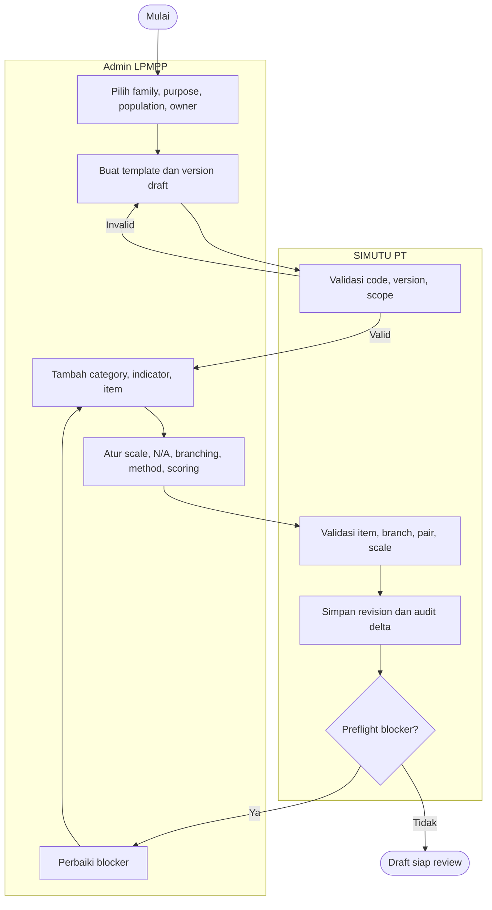
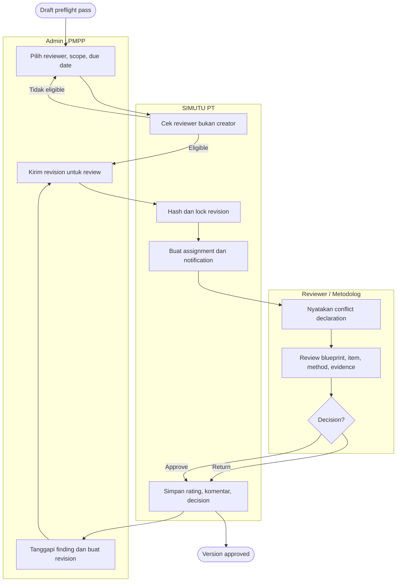
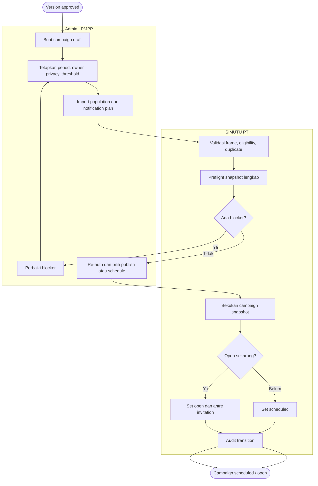
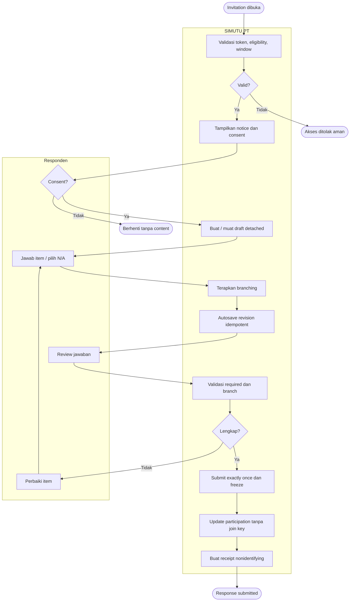
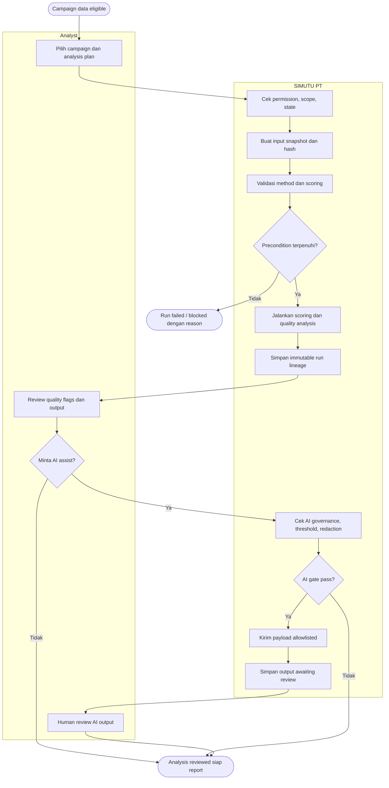
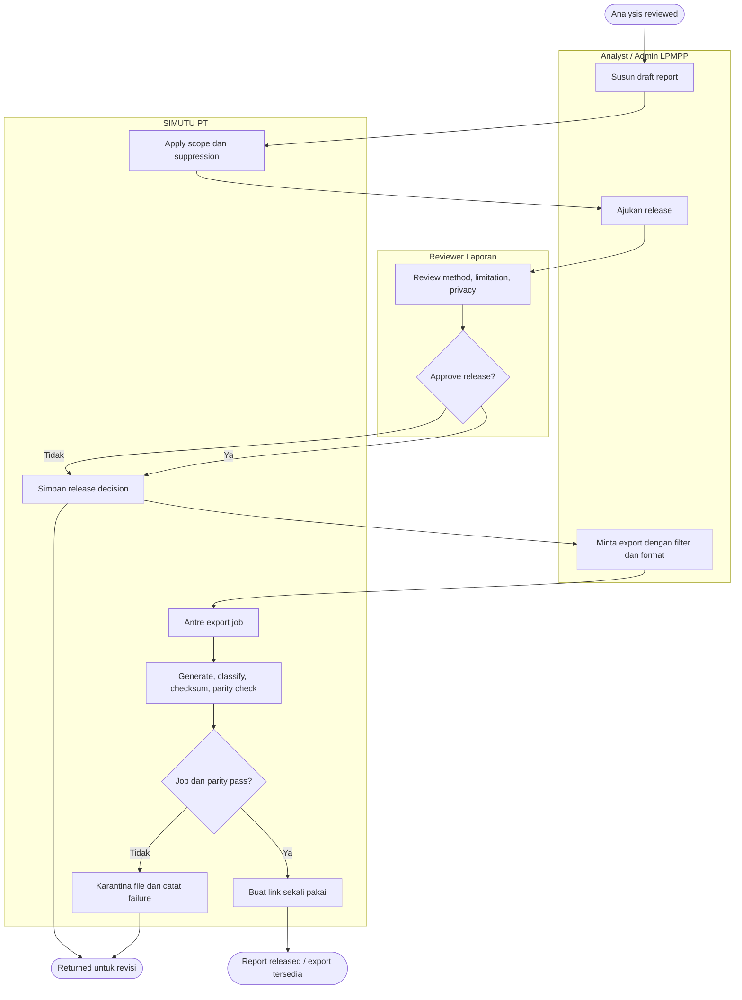
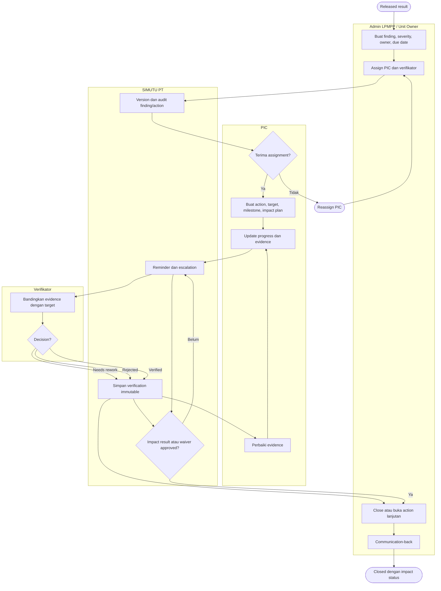

# Activity Diagrams

Versi: **1.0 — 2026-08-07**

Diagram memakai flowchart Mermaid sebagai activity view. Rounded node menandai start/end, diamond adalah decision/guard, dan subgraph menunjukkan responsibility lane.

## 1. Pembuatan survei dan pertanyaan

## 2. Review instrumen

## 3. Publikasi campaign

## 4. Pengisian dan submit response

## 5. Analisis statistik dan AI extension

AI yang diblokir tidak menggagalkan analysis statistik utama.

## 6. Laporan dan export

## 7. Finding dan tindak lanjut PPEPP

