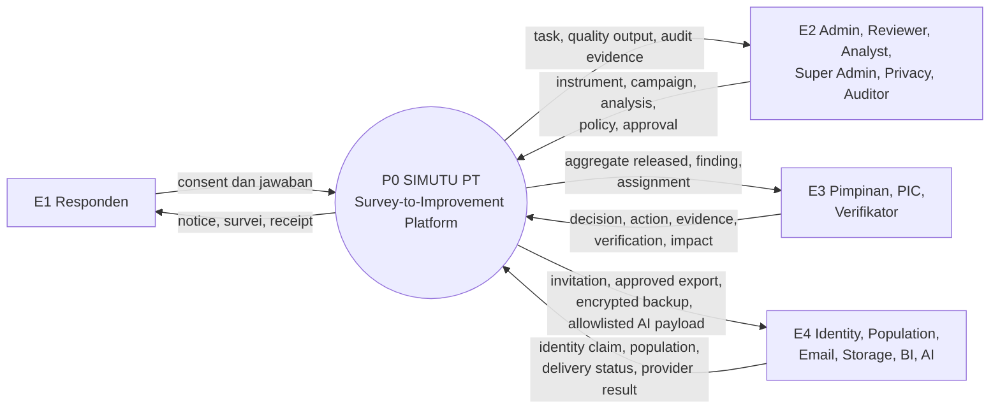
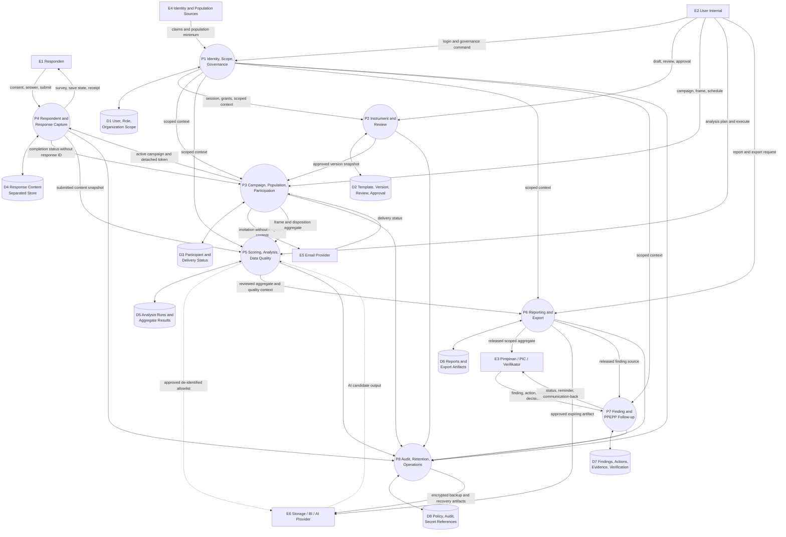
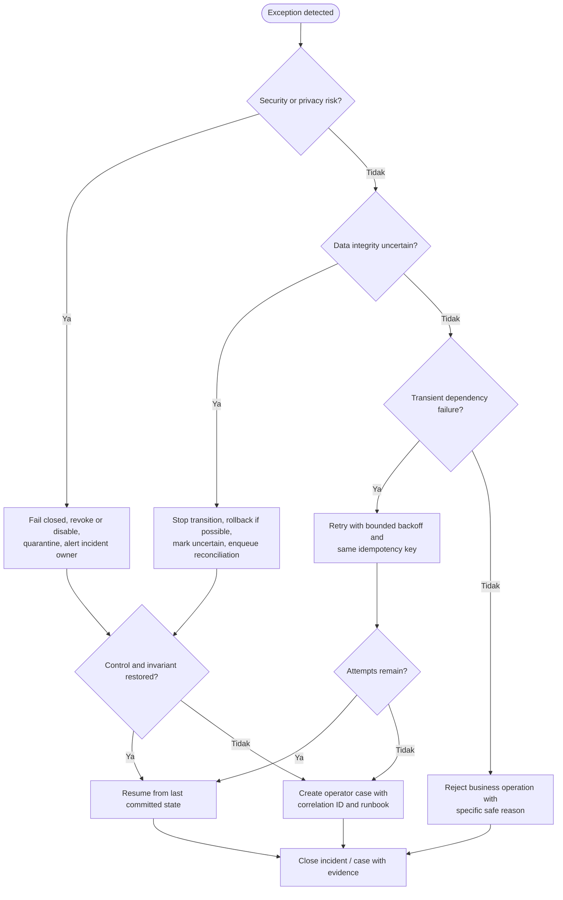

# Data Flow Diagrams, Exception Flow, and Recovery

Versi: **1.0 — 2026-08-07**

Notation: rectangle = external entity/actor, rounded node = logical process, cylinder = logical data store. Store adalah responsibility boundary, bukan keputusan database/container Phase 06.

## 1. DFD Level 0

Level 0 hanya menunjukkan pertukaran data dengan boundary. Raw response tidak mengalir langsung ke pimpinan/PIC atau provider email.

## 2. DFD Level 1

## 3. Data-flow controls

| Flow | Allowed data | Prohibited data | Control |
|---|---|---|---|
| Population source → P1/P3 | identifier/contact/eligibility minimum | unrelated academic/personal fields | schema allowlist, purpose, source date |
| P3 → email | recipient, campaign, due date, secure token | response content, raw comment, secret | template placeholder allowlist |
| P4 → D4 | consent reference and response content | name/NIM/email/IP/user-agent pada detached mode | separated store and privacy test |
| P4 → P3 | complete/partial status tied to detached invitation status | response ID/item/value | no join-key contract |
| D4/P5 → P6 | aggregate, `n`, missing, coverage, limitation | raw content unless exception | scope, suppression, release review |
| P5 → AI | de-identified allowlisted pool above threshold | identifier, secret, small pool, unapproved fields | governance gate, redaction, human review |
| P6 → external file | approved, classified, suppressed output | unsuppressed/cross-scope data | parity test, encryption, expiry, audit |
| P6 → P7 | released result/finding reference | respondent-level content | aggregate-only contract |

## 4. Exception classification and recovery flow

## 5. Exception and recovery matrix

| Exception | Detection | Immediate action | Recovery | Invariant |
|---|---|---|---|---|
| Authentication/authorization denied | policy result | deny and audit safe reason | user re-auth atau owner memperbaiki grant | tidak ada fallback broad access |
| Concurrent instrument edit | revision/hash mismatch | reject write | reload, compare, reapply ke revision baru | published/reviewed hash tidak berubah |
| Publish preflight failure | blocker list | campaign tetap draft/approved version aman | perbaiki field lalu rerun preflight | campaign tidak open setengah lengkap |
| Autosave network failure | timeout/status unsaved | pertahankan local unsaved state | bounded retry same idempotency key | tidak ada silent data loss/duplicate |
| Submit cross-store uncertainty | participation timeout setelah content commit | receipt processing + reconciliation case | detached reconciliation tanpa response ID | response exactly once, no identity-content join |
| Analysis worker failure | job heartbeat/exception | run failed, no release | retry new attempt same immutable input | partial output tidak released |
| AI provider failure | timeout/429/5xx/malformed | fail job/quarantine; statistik tetap berjalan | backoff atau manual analysis | no auto-approved AI output |
| Secret exposure suspicion | scanner/log incident | feature off, revoke/rotate, contain logs | incident response dan clean config | secret tidak ditampilkan kembali |
| Export parity/suppression failure | golden/parity check | quarantine and revoke file | correct policy/job and generate new artifact | unsafe file never downloadable |
| Evidence checksum mismatch | integrity check | block verification/closure | restore verified evidence or investigate | corrupt evidence tidak diverifikasi |
| Notification provider failure | delivery error/bounce threshold | retain assignment/campaign state | idempotent retry or approved alternate channel | notification tidak menentukan truth state |
| Backup/restore failure | drill/checksum/application check | raise critical operation issue | alternate backup, rebuild, reconcile RPO | successful backup job alone bukan recovery proof |

## 6. Recovery requirements

- Recovery dimulai dari state committed terakhir, tidak mengedit histori untuk “merapikan” error.
- Retry mempunyai batas, backoff, idempotency key, attempt history, dan dead-letter/manual case.
- Compensation tidak boleh menciptakan link baru antara participant identity dan response content.
- Security/privacy exception mengutamakan containment daripada availability.
- Error user-facing berisi aksi lanjut dan correlation ID, bukan stack trace, raw query, identifier lain, atau secret.
- Operator runbook/owner/SLA ditentukan sebelum controlled pilot; target RPO/RTO masih memerlukan persetujuan.
