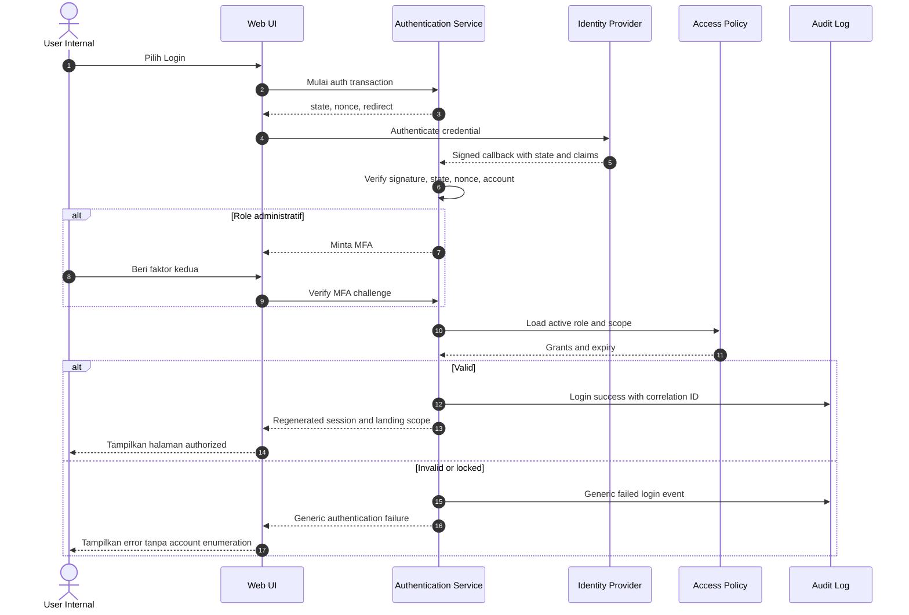
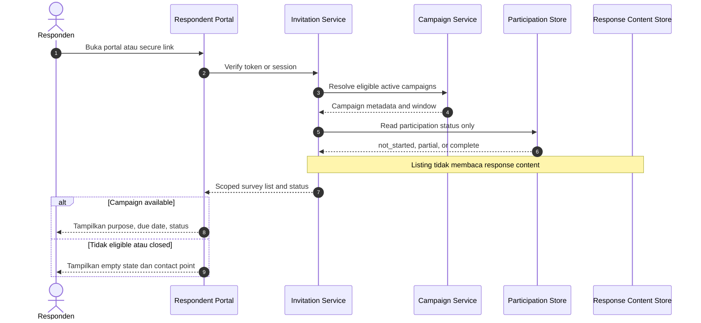
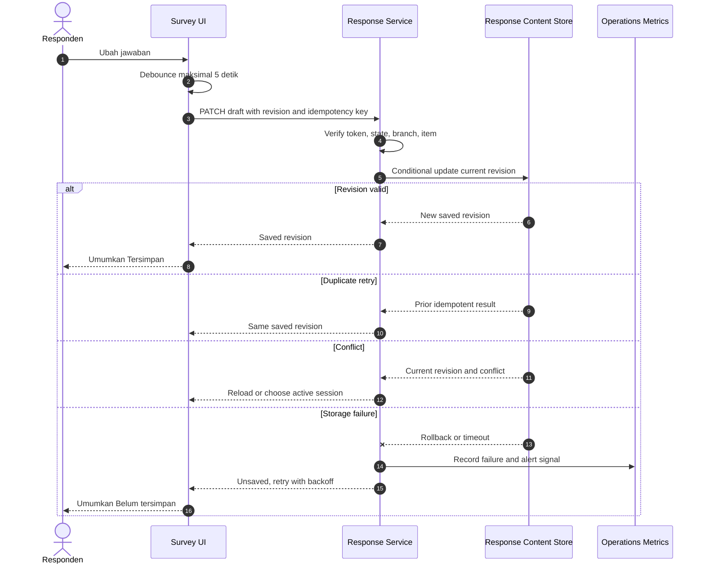
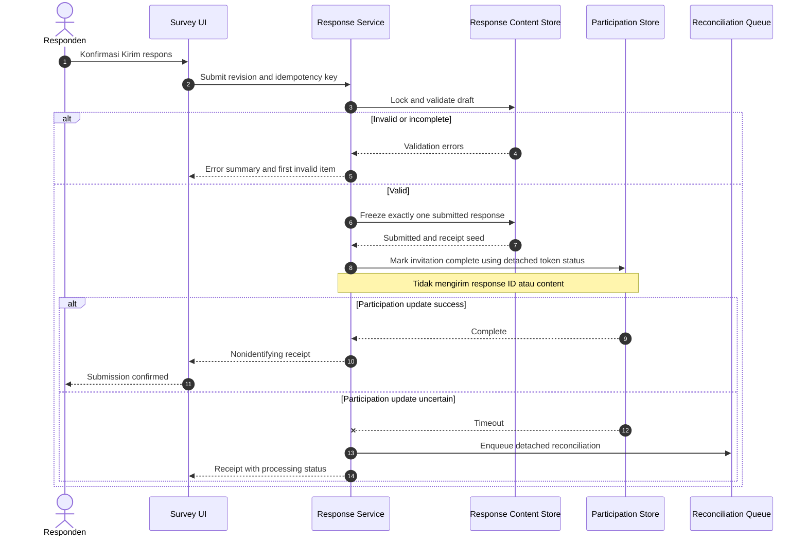
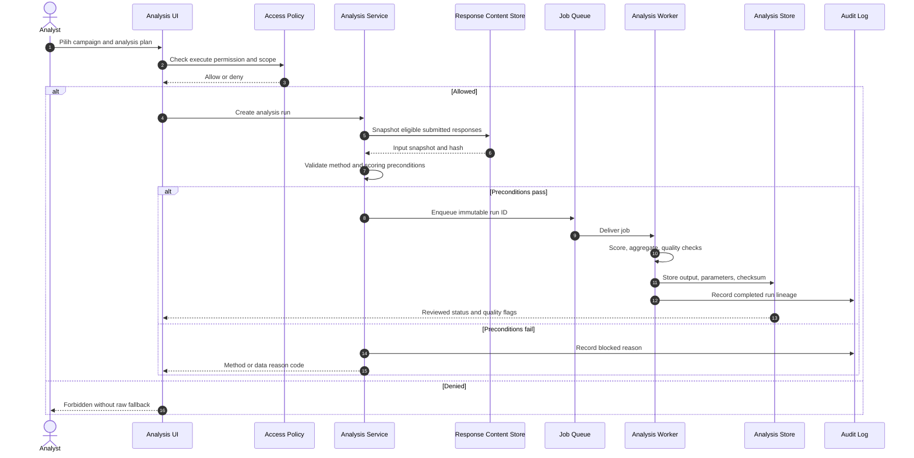
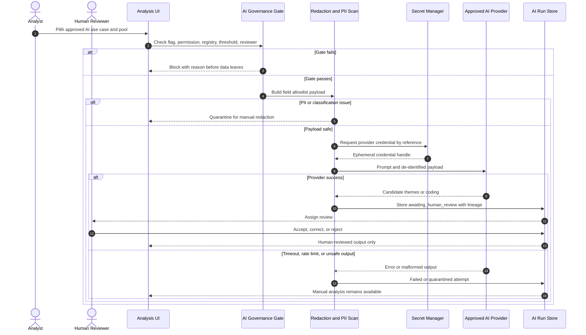
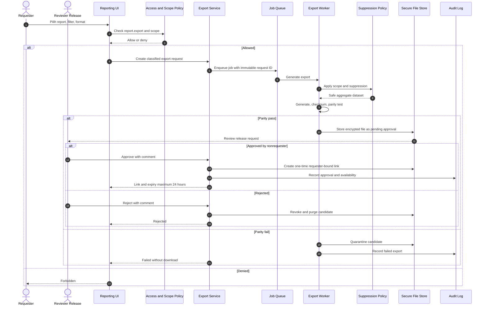
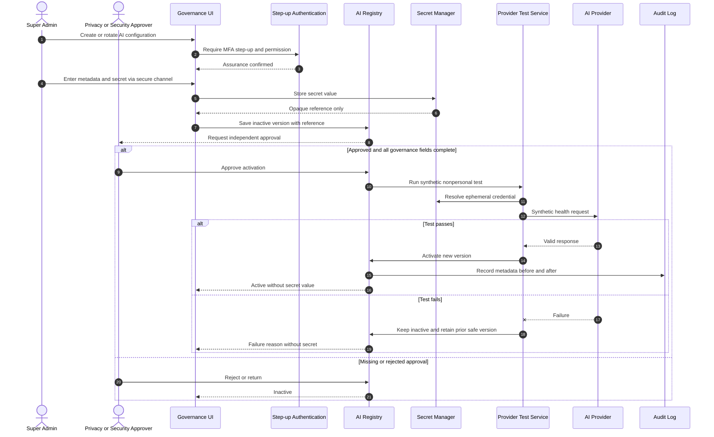

# Sequence Diagrams

Versi: **1.0 — 2026-08-07**  
Catatan: participant bernama `Service/Store` adalah tanggung jawab logis, bukan keputusan container Phase 06.

## 1. Login

## 2. Daftar survei responden

## 3. Autosave

## 4. Submit respons final

## 5. Agregasi dan analisis statistik

## 6. Analisis AI

## 7. Export laporan

## 8. Konfigurasi secret API AI

## 9. Recovery principles across sequences

- client/network retry menggunakan idempotency key;
- async job mempunyai immutable request/run ID serta attempt history;
- provider failure tidak menjatuhkan respondent/statistical core flow;
- partial output tidak released dan file gagal dikarantina;
- compensation/reconciliation dipakai saat cross-store status uncertain tanpa membuat join identity–content;
- setiap failure mengembalikan correlation ID yang aman, bukan stack trace/secret.
