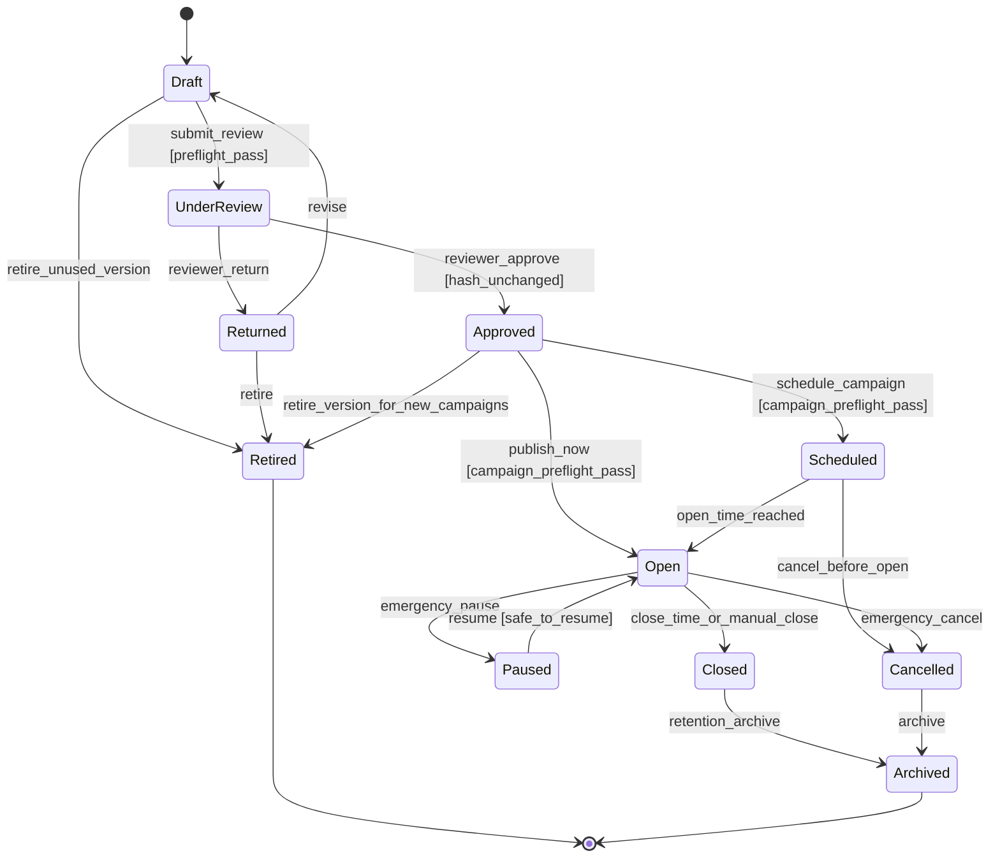
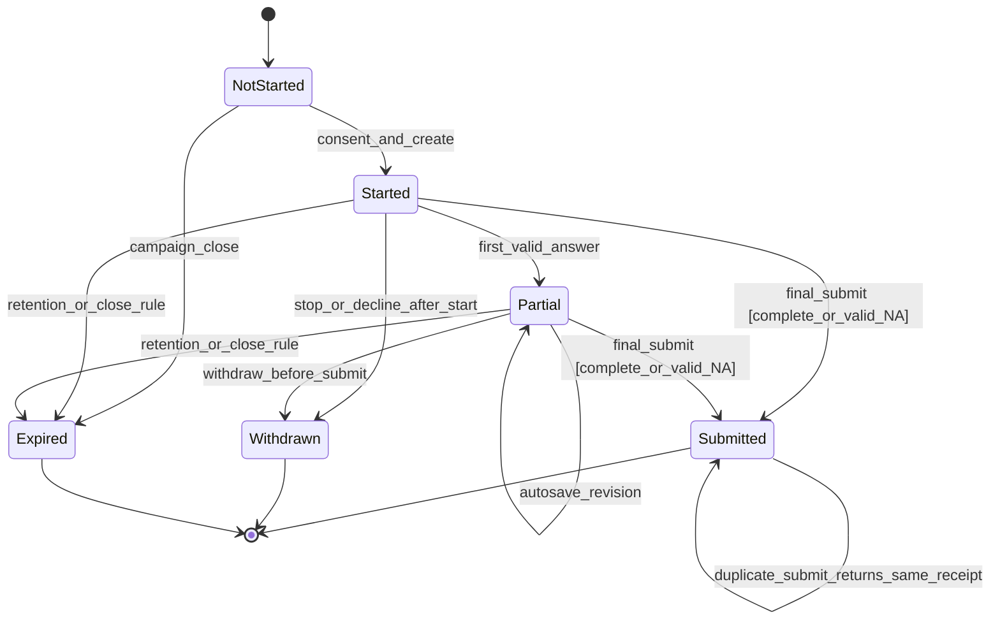
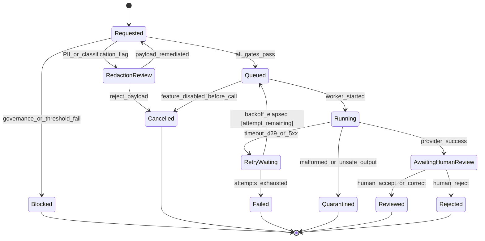
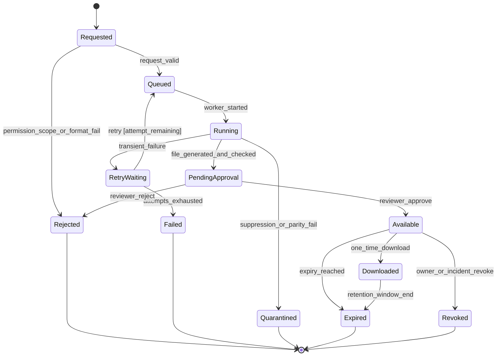
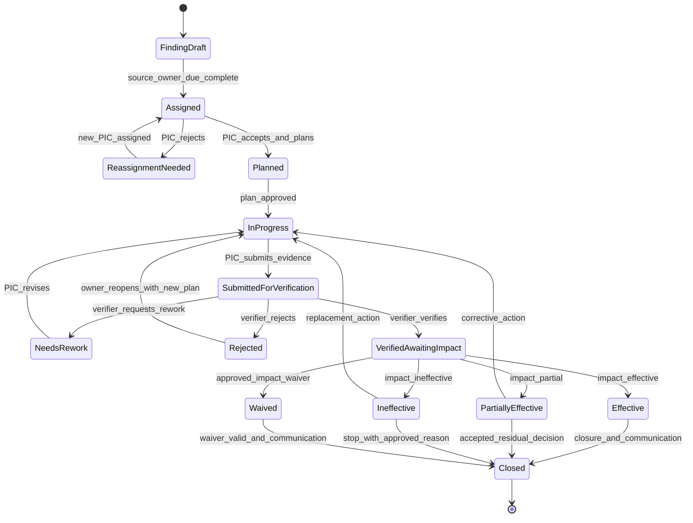

# State Machines

Versi: **1.0 — 2026-08-07**

Transition hanya terjadi setelah permission, scope, guard, dan invariant object lulus. Audit event mencatat transition penting; UI label tidak menjadi source of truth.

## 1. Lifecycle survei: instrument version dan campaign

`Approved` version tetap immutable dan dapat menjadi provenance campaign lama walau `Retired`. Pause tidak menghapus response; rule grace/submit harus dipin.

## 2. Lifecycle response

`Submitted` immutable. Correction tidak mengembalikan response ke draft; jika policy mengizinkan koreksi, correction artifact/version baru harus dirancang terpisah.

## 3. Lifecycle AI job

Hanya `Reviewed` output boleh dipertimbangkan untuk report. `Blocked` terjadi sebelum data dikirim.

## 4. Lifecycle report export

File `Quarantined`, `Rejected`, `Failed`, `Expired`, atau `Revoked` tidak dapat diunduh. Download tidak mengubah classification atau onward-sharing restriction.

## 5. Lifecycle finding dan follow-up

`Evidence uploaded` tidak mempunyai state sendiri yang berarti selesai. `VerifiedAwaitingImpact` membedakan implementation verification dari effectiveness.

## 6. State invariants

| Object/state | Invariant |
|---|---|
| Version UnderReview/Approved | content hash locked; creator tidak sole approver |
| Campaign Scheduled/Open | version approved dan snapshot lengkap |
| Response Submitted | immutable, exactly-once, receipt stabil |
| AI Queued/Running | governance gate dan secret reference valid pada dispatch; kill switch dapat membatalkan |
| Export Available | scope/suppression parity pass dan approval nonrequester bila diwajibkan |
| Follow-up SubmittedForVerification | evidence version/checksum dan acceptance target tersedia |
| Follow-up Closed | verified dan impact result atau approved waiver; communication-back tercatat |
