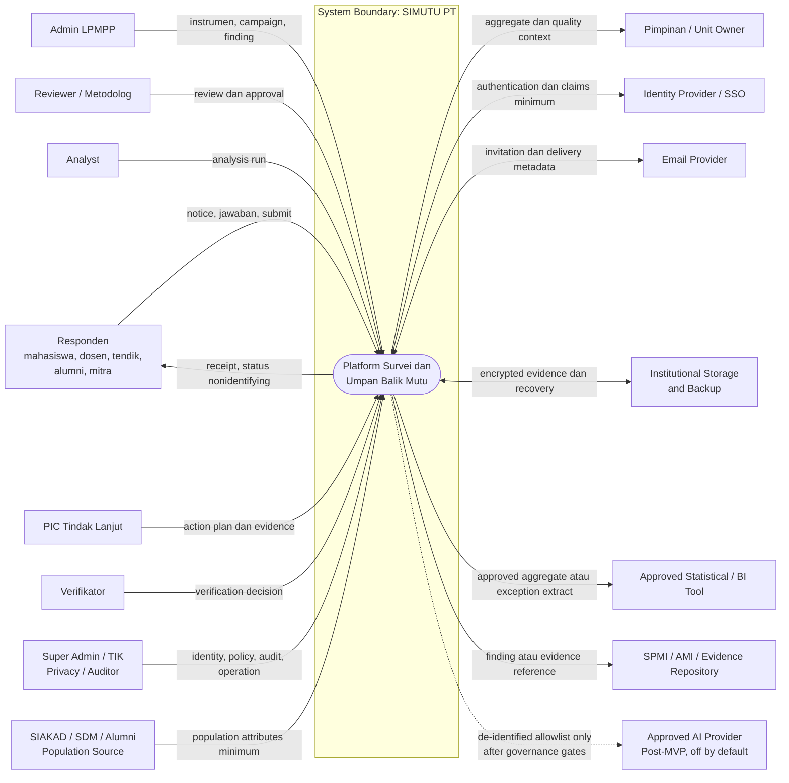

# System Context

Versi: **1.0 — 2026-08-07**  
Level: **logical process context, bukan C4 container/component architecture**

## 1. Context diagram

## 2. System boundary

Di dalam boundary:

- governance instrument dan version;
- campaign, population, participation, dan response;
- scoring/analysis lineage serta aggregate report;
- finding, action, evidence, verification, dan impact plan;
- role/data scope, privacy policy, audit, export control, dan operational status.

Di luar boundary:

- sumber identitas dan population tetap authoritative pada sistem asal;
- email provider hanya menerima metadata/pesan tanpa response content;
- SPMI/AMI tetap sistem/proses yang lebih luas;
- statistical tool menerima data hanya melalui export yang approved;
- AI provider tidak termasuk MVP dan tidak boleh dipanggil tanpa governance gates;
- SIMUTU PT bukan whistleblowing, case management, atau sistem keputusan individual.

## 3. Trust and data boundaries

| Boundary | Rule |
|---|---|
| Participant identity ↔ response content | dipisahkan; detached mode tidak mempunyai join key |
| Internal user ↔ protected object | authentication, operation permission, organization scope, assignment, state, dan classification diperiksa |
| Result ↔ leader/PIC | aggregate/released result saja; threshold dan suppression tetap berlaku |
| Export ↔ recipient | purpose, approval, scope, classification, expiry, dan audit |
| Platform ↔ provider | TLS, allowlist, timeout/retry/idempotency, minimum fields, dan failure isolation |
| Platform ↔ AI | feature off, registry/DPIA/provider approval, de-identification, threshold, human review, kill switch |

## 4. Context assumptions requiring confirmation

- satu institusi/tenant awal;
- identity provider, population source, hierarchy, email provider, dan storage belum dipilih;
- scale/capacity/team belum dikonfirmasi, sehingga diagram tidak menetapkan topology atau deployment pattern;
- integration SPMI/BI/AI adalah boundary option, bukan komitmen MVP.

