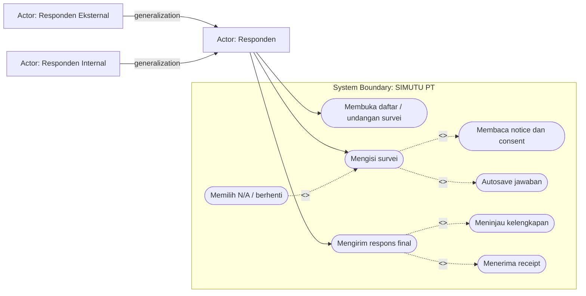
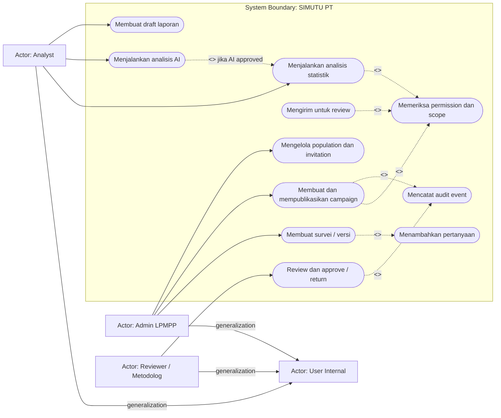
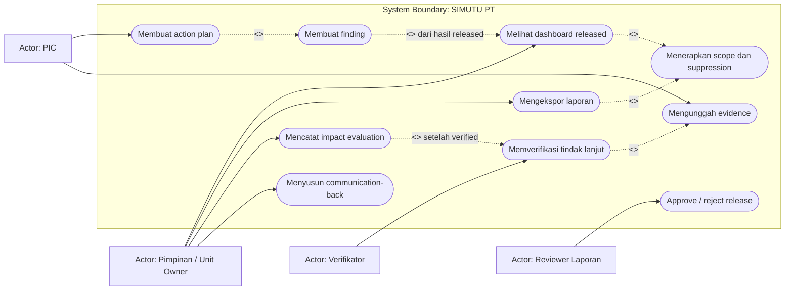
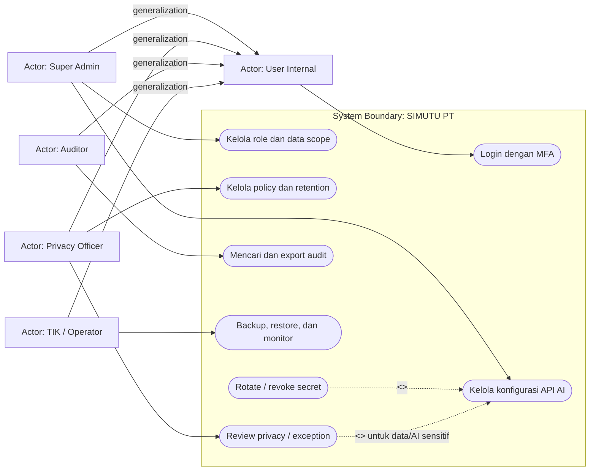

# Use Case Diagrams

Versi: **1.0 — 2026-08-07**

Mermaid belum mempunyai notasi UML use-case native yang seragam. Diagram memakai `flowchart` dengan actor di luar subgraph **System Boundary**, use case berbentuk rounded node, dan label relasi UML eksplisit.

## 1. Notasi relasi

- **Association:** actor menggunakan use case.
- **`<<include>>`:** use case sumber selalu menjalankan perilaku target sebagai bagian wajib.
- **`<<extend>>`:** use case sumber hanya menambah perilaku target pada kondisi tertentu.
- **Generalization:** actor/use case khusus mewarisi kemampuan actor/use case umum; panah bergerak dari khusus ke umum.
- Include/extend bukan urutan waktu. Urutan terdapat pada activity/sequence diagram.

## 2. Responden

## 3. Pengelola instrumen, campaign, dan analisis

## 4. Pimpinan dan feedback loop

## 5. Governance dan operasi

## 6. Generalization boundaries

Generalization tidak berarti seluruh actor khusus memiliki permission actor lain. `User Internal` hanya mewariskan kebutuhan login/session; authorization tetap berdasarkan operation, data scope, object state, assignment, dan classification. Responden internal/eksternal berbagi respondent flow, tetapi metode autentikasi/invitation dapat berbeda.
