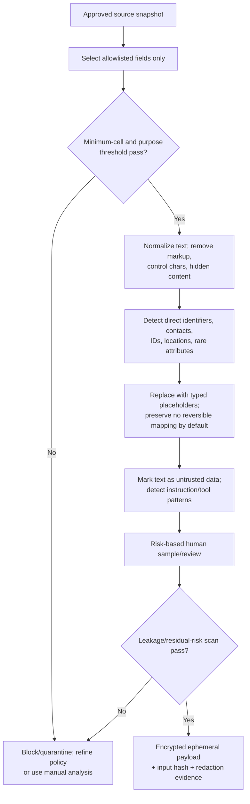

# AI Governance and Provider Architecture

Versi: **1.0 — 2026-08-07**  
Status: **Post-MVP, disabled by default; design approval does not authorize data transfer**

AI is an optional assistant for bounded qualitative coding/summarization or draft recommendation. It does not calculate authoritative scores, decide respondent eligibility, identify individuals, approve/release reports, close findings, or replace human/statistical evidence.

## 1. Governance principles

- **Govern first:** every use case, dataset, provider/model, prompt, reviewer, budget, and retention behavior is registered before execution.
- **Minimize:** prefer released aggregates; raw open text is allowed only after necessity, threshold, redaction, and purpose approval.
- **Treat input/output as untrusted:** respondent text can contain prompt injection; model output can hallucinate or reproduce sensitive text.
- **Human accountability:** no AI output reaches report/finding/action without qualified human review and evidence trace.
- **Fail closed:** redaction/evaluation/provider/secret/budget failure stops AI while statistical analysis and PPEPP remain available.
- **Reproducibility limits are explicit:** provider/model behavior may drift; lineage permits audit, not a false claim of deterministic rerun.

The control lifecycle aligns with the NIST AI RMF functions Govern, Map, Measure, and Manage and its [Generative AI Profile](https://www.nist.gov/itl/ai-risk-management-framework), adapted to survey privacy and institutional governance.

## 2. Permitted and prohibited uses

| Use case | Default | Required input | Human outcome |
|---|---|---|---|
| Theme suggestion for sufficiently large redacted open-text set | gated post-MVP | redacted excerpts/derived features above threshold | analyst accepts/edits/rejects codes with cited evidence |
| Draft summary of released aggregate | gated post-MVP | released suppressed snapshot only | analyst verifies every number/claim |
| Draft action ideas | gated post-MVP | released finding/context without personal data | unit owner assesses feasibility; no auto-assignment |
| Translation of approved questionnaire/report text | gated and separately evaluated | nonrespondent approved content | bilingual reviewer approval |
| Automatic scoring/statistical calculation | prohibited as source of truth | n/a | deterministic governed method is authoritative |
| Individual profiling, sentiment/discipline/admission/employment decision | prohibited | n/a | not allowed |
| Re-identification or joining identities to response | prohibited | n/a | not allowed |
| Sending invitation/contact, raw sensitive demographics, small cells, secret, or linkage data | prohibited | n/a | not allowed |
| Autonomous publication, finding closure, or verification | prohibited | n/a | not allowed |

## 3. Provider adapter boundary

```mermaid
flowchart LR
    REQUEST["Approved AI use-case request"]
    REGISTRY["Use-case + provider/model registry"]
    GATE["Permission, purpose, dataset class,<br/>minimum n, budget, reviewer gate"]
    EXTRACT["Allowlisted data projection"]
    REDACT["Deterministic + reviewed redaction"]
    PROMPT["Immutable prompt template/version<br/>with untrusted-data delimiters"]
    ADAPTER["Provider-neutral AI Adapter"]
    EGRESS["Endpoint allowlist + SSRF/egress control"]
    PROVIDER["Approved provider/model"]
    VALIDATE["Schema, safety, leakage,<br/>grounding and cost validation"]
    QUARANTINE["Quarantined AI result"]
    HUMAN["Assigned human review"]
    RELEASE["Approved derivative linked to evidence"]
    REJECT["Reject/purge/escalate"]

    REQUEST --> REGISTRY --> GATE
    GATE -->|"pass"| EXTRACT --> REDACT --> PROMPT --> ADAPTER --> EGRESS --> PROVIDER
    GATE -->|"fail"| REJECT
    PROVIDER --> VALIDATE
    VALIDATE -->|"pass"| QUARANTINE --> HUMAN
    VALIDATE -->|"fail"| REJECT
    HUMAN -->|"approve/edit with rationale"| RELEASE
    HUMAN -->|"reject"| REJECT
```

### Adapter contract

| Concern | Contract |
|---|---|
| Input | `use_case`, prompt version, structured redacted payload, response schema, model registry ID, token/cost/time limits, idempotency key |
| Output | normalized structured candidate, provider request ID hash, model/version label, token counts, cost, latency, finish reason, safety metadata |
| Errors | normalized safe codes: validation, budget, rate, timeout, provider, schema, safety, circuit-open; no raw provider body in ordinary log |
| Capability | explicit registry flags for structured output, data residency, zero-retention, no-training, context/output limits |
| Transport | fixed provider slug to exact allowlisted endpoint; HTTPS verification; no arbitrary tool URL/callback/redirect |
| Secret | runtime resolution from KMS reference; adapter never serializes/returns secret |

One concrete adapter is sufficient initially. A common contract exists at the external boundary to avoid provider-specific logic in domain services; it is not permission for dynamic plugins or arbitrary provider URLs.

## 4. Configuration and approval model

An `ai_configuration` is immutable once approved and contains:

- use-case registry ID and owner;
- provider/model slug from approved registry;
- opaque secret reference + masked fingerprint, never secret value;
- endpoint-policy ID, data residency/retention/no-training evidence version;
- input classification ceiling and prohibited-field list;
- prompt/redaction/evaluation policy versions;
- model parameters constrained per use case;
- per-job/daily/monthly token and currency limits;
- timeout, retry, concurrency, circuit-breaker policy;
- effective period, approvers, review/expiry date, kill switch.

Approval requires AI use-case owner, Data Owner/LPMPP, Privacy Officer, and TIK Security; procurement/legal joins when external processing/contract is involved. Model/provider/endpoint/retention change creates a new version and re-evaluation.

## 5. Redaction pipeline

### Redaction requirements

- Direct identifiers: name, NIM/NIP, email, phone, account/URL handles, addresses, IDs, token/secret patterns.
- Indirect/quasi identifiers: rare unit/program/role combinations, exact date/time/location, named events/persons, unique case descriptions.
- Open text is Restricted before redaction and remains Restricted until risk review passes; “de-identified” is not automatically anonymous.
- Deterministic recognizers are versioned and evaluated in Indonesian plus relevant institutional terms. Model-based redaction cannot be the only control.
- Typed placeholders such as `[PERSON]`, `[UNIT]`, `[DATE_COARSENED]` are nonreversible by default. Any mapping needed for approved manual correction remains local, encrypted, short-lived, and never sent.
- Prompt injection text is not executed. Adapter exposes no browsing/tools/function calls unless a separate approved use case exists; none is approved for this baseline.
- Payload staging and redaction map are purged after result/evidence completion per shortest approved TTL.

## 6. Prompt versioning

Each prompt record contains:

| Field | Requirement |
|---|---|
| `prompt_id/version` | immutable semantic version; owner and approval state |
| `use_case` | one bounded task and prohibited decisions |
| `system_template` | fixed instructions; respondent text inserted only as delimited data |
| `input_schema/output_schema` | strict JSON/schema and size/cardinality limits |
| `evidence_contract` | every theme/claim cites approved source excerpt ID or aggregate cell ID |
| `safety_rules` | no identities, unsupported inference, sensitive trait inference, instruction following from data |
| `model parameters` | approved temperature/output cap etc.; changes trigger version/evaluation |
| `redaction/evaluation versions` | immutable references |
| `checksum` | canonical content checksum captured in job/result/audit |

Prompt content, model name alone, and confidence-like language are not proof. Provider drift is monitored using fixed evaluation sets and release gates.

## 7. Prompt-injection and output controls

- Wrap user text in a clearly delimited data structure and state it is untrusted evidence, never instruction.
- No secrets/system prompt/internal policy are included unless essential; provider response cannot request additional data dynamically.
- Tool/function/network/file execution is disabled for baseline AI use cases.
- Output must validate against strict schema; unknown fields, embedded HTML/URLs, oversized arrays, malformed citations, or instruction echoes cause quarantine.
- Scan output for PII/token/canary, copied long passages, unsupported sensitive inference, defamation/toxicity, and numerical inconsistency.
- Numerical claims must resolve to released aggregate IDs; AI is not allowed to invent/recalculate denominators or suppression.
- UI labels all output as AI-assisted draft with provider/model/prompt/evaluation lineage and reviewer disposition.

## 8. Cost and resource control

### Reservation and settlement

1. Estimate tokens/cost from redacted payload and registry price version.
2. Atomically reserve against per-job, use-case daily, configuration monthly, and institution monthly budgets.
3. Reject before provider call if any limit, concurrency, or reviewer-capacity threshold fails.
4. Execute once per logical idempotency key; retry does not create a new budget reservation.
5. Settle actual input/output tokens and cost; reconcile provider invoice without storing raw prompt.
6. Alert at 50/80/100%; 100% opens circuit. Overrides require new time-bound approval and reason.

| Control | Baseline |
|---|---|
| Job input/output token cap | required per use case; exact value PROPOSED |
| Daily/monthly currency cap | required; exact value and currency owner-approved |
| Concurrent jobs | bounded per provider/use case |
| Retry | only transient error, exponential backoff+jitter, maximum approved attempts; no retry on safety/schema/budget failure |
| Timeout | connect/read/total fixed in endpoint policy |
| Circuit breaker | opens on error/rate/cost threshold; manual/automatic recovery audited |
| Kill switch | institution, use-case, provider/model, and configuration levels |

## 9. Evaluation framework

Evaluation occurs before initial activation, on any material provider/model/prompt/redaction/policy change, periodically, and after incident/drift alert.

| Dimension | Metric/evidence | Initial release gate (PROPOSED) |
|---|---|---|
| PII leakage | seeded/canary direct and indirect identifier leak rate | 0 critical/direct leaks; any leak blocks |
| Grounding | supported claims/codes divided by all claims/codes | ≥95%; no unsupported high-impact claim |
| Citation correctness | cited excerpt/cell actually supports claim | ≥95%; 100% for released numerical claim |
| Theme quality | blinded expert agreement/precision-recall on approved benchmark | threshold per use case; baseline to be established |
| Hallucination | unsupported factual or numerical assertions | ≤2% low-impact; 0 high-impact `[P]` |
| Instruction resistance | successful prompt-injection/tool/redaction bypass | 0 on critical test set |
| Stability | variance across repeated fixed-set runs | documented band; material drift triggers review |
| Fairness | quality/error by permitted stakeholder/language subgroup above reporting threshold | no unexplained material gap; owner-defined bound |
| Cost/latency | p50/p95 tokens, cost, latency, failure | within approved budget/SLO |
| Reviewer burden | accept/edit/reject rate and minutes/result | demonstrates benefit rather than hidden workload |

Evaluation dataset must be synthetic or consented/de-identified with provenance, classification, purpose, retention, and contamination controls. Production responses are not silently added to benchmarks.

## 10. Human review and release

Reviewer must see:

- task/use case, input classification and redaction evidence;
- provider/model, prompt/redaction/evaluation versions;
- candidate output with source citations/aggregate cells;
- automated flags, cost/tokens, and known limitations;
- `approve`, `approve_with_edit`, or `reject` with rationale.

Reviewer verifies source support, privacy, neutral wording, numerical parity, suppressed-cell protection, bias/unsupported inference, and actionable interpretation. Reviewer cannot approve their own configuration exception where SoD applies. Edited output is stored as human-authored derivative while preserving original quarantined candidate hash; rejected content is not released.

AI job states: `draft → preflight → queued → running → validating → review_pending → approved/rejected`; `retry_waiting`, `failed`, `quarantined`, `cancelled` are terminal/recovery paths as defined in Phase 05. Only `approved` derivative can be referenced from a report/finding.

## 11. Provider due diligence

Before allowlisting, record evidence for:

- legal entity, service/subprocessor locations, data residency and transfer basis;
- training/data-use opt-out and retention/deletion behavior, with zero-retention target;
- security assurance, incident notification, access controls, encryption, deletion, and audit capabilities;
- stable model/version identification, deprecation/change notice, rate/availability limits;
- endpoint/certificate/domain ownership, supported IP/egress patterns, and no forced redirect;
- pricing source/version, usage export, quota, billing reconciliation;
- DPA/contract exit, data deletion confirmation, and secret revocation procedure.

Provider marketing claims are not control evidence. Contract/configuration plus technical canary, egress, retention, and evaluation evidence are required.

## 12. AI incident response

Triggers: suspected data leak, PII/canary output, prompt injection success, arbitrary endpoint/SSRF, secret exposure, provider policy change, cost anomaly, harmful/unsupported released output, or evaluation regression.

Response:

1. Kill switch affected configuration/provider/use case; cancel queued jobs.
2. Revoke/rotate secret and isolate prompt/result/staging with access audit.
3. Stop release/use of affected outputs; revoke/supersede reports/findings if needed.
4. Determine affected datasets/providers/recipients using hashes and lineage without broadly exposing raw content.
5. Notify privacy/security/legal authority under institutional incident rules.
6. Obtain provider deletion/containment evidence; preserve approved incident evidence.
7. Correct controls, re-evaluate full relevant suite, and require new approval before activation.

## 13. Activation checklist

- [ ] use case proves benefit and cannot be met adequately by deterministic/manual method;
- [ ] owner, purpose, lawful basis, privacy impact, retention, and prohibited use approved;
- [ ] provider/model/endpoint/KMS/contract registry approved; no free-form Base URL;
- [ ] secret only in write-only secret manager and SSRF/egress tests pass;
- [ ] allowlisted projection, threshold, redaction, prompt-injection, output schema, and leakage tests pass;
- [ ] evaluation gates and subgroup review pass on governed dataset;
- [ ] budget/reservation/retry/circuit/kill-switch controls tested;
- [ ] qualified independent human reviewer and SoD available;
- [ ] audit, deletion, provider exit, and incident runbooks drilled;
- [ ] leadership explicitly approves activation.

Until every applicable box has evidence, AI remains off and manual/statistical workflow is the supported path.
