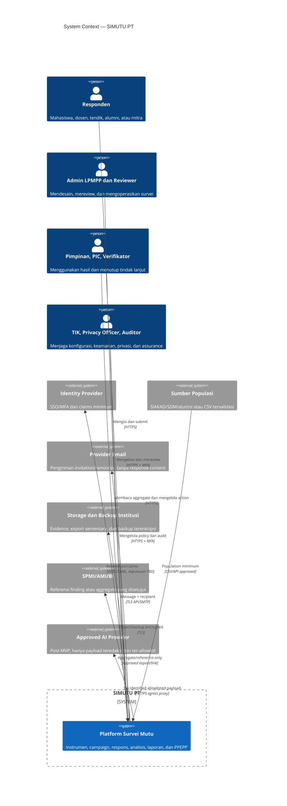

# Architecture

Versi: **1.0 — 2026-08-07**  
Status: **PROPOSED untuk persetujuan pemilik sistem**  
Scope: desain Phase 06; tidak menyatakan komponen produksi telah diimplementasikan.

## 1. Architectural drivers

| Driver | Implikasi desain |
|---|---|
| Satu institusi dan tim/volume belum dikonfirmasi | modular monolith, bukan microservices; scale-out hanya setelah bukti capacity |
| Raw response, identitas, dan secret berisiko tinggi | least privilege, store/credential terpisah, encryption, audit, dan fail-closed |
| Mode detached anonymous-content | tidak ada persisted join key antara invitation/participation dan response content |
| Instrument published dan hasil released harus reproducible | version/snapshot immutable, input checksum, lineage, dan append-only decision history |
| Dashboard/export wajib konsisten | snapshot agregat durable menjadi sumber rilis; Redis tidak menghitung ulang policy |
| Email/AI/storage dapat gagal | outbox, idempotency, bounded retry, dead-letter case, dan degraded mode |
| AI bukan MVP dan berisiko data leakage | disabled by default, adapter allowlist, redaction, budget, evaluation, dan human approval |
| RPO/RTO belum disahkan | baseline `PROPOSED`: RPO ≤15 menit, RTO core ≤4 jam |

Prinsip: PostgreSQL adalah source of truth; Redis dan generated files dapat direkonstruksi. Setiap access decision adalah irisan identity assurance, permission, organizational scope, assignment/purpose, object state, dan data classification.

## 2. C4 Level 1 — System context

System boundary mencakup seluruh keputusan bisnis, authorization, suppression, audit, dan orchestration. IdP, sumber populasi, provider email, object storage/KMS, SPMI/BI, dan AI tetap external system; kegagalannya tidak boleh mengubah state bisnis menjadi sukses palsu.

## 3. C4 Level 2 — Containers

```mermaid
C4Container
    title Container Diagram — SIMUTU PT

    Person(respondent, "Responden", "Pengisi survei")
    Person(internal, "User Internal", "Admin, reviewer, analyst, pimpinan, PIC, auditor")

    System_Boundary(simutu, "SIMUTU PT") {
        Container(edge, "Web Edge", "Nginx/TLS", "Same-origin routing, security headers, static assets, request limits")
        Container(spa, "Respondent and Dashboard SPA", "Vue + Vite build", "Accessible first-party UI")
        Container(app, "Laravel Application", "PHP/Laravel + Filament", "HTTP API, admin panel, domain rules, policy, orchestration")
        Container(worker, "Queue Workers", "Laravel Horizon", "Notification, analysis, AI, export, retention, reconciliation")
        Container(scheduler, "Scheduler", "Laravel Scheduler", "Dispatch periodic jobs, expiry, retention, monitoring")
        ContainerDb(coredb, "Core Database", "PostgreSQL", "Identity, instrument, campaign, participation, governance, aggregates")
        ContainerDb(responsedb, "Response Content Database", "PostgreSQL separate database/role", "Responses, answers, response metadata; no direct identity")
        ContainerDb(linkvault, "Linkage Vault", "PostgreSQL separate database/role", "Only confidential mode; encrypted response-identity mapping")
        ContainerQueue(redis, "Redis", "Redis", "Queue transport, rate limit, ephemeral cache/session; never source of truth")
        ContainerDb(objects, "Private Object Storage", "S3-compatible/institutional", "Evidence, reports, exports, backups; encrypted and versioned")
    }

    System_Ext(idp, "Identity Provider", "SSO/MFA")
    System_Ext(mail, "Email Provider", "Delivery")
    System_Ext(ai, "AI Provider Registry", "Approved endpoints only")
    System_Ext(kms, "Secret Manager/KMS", "KEK, provider secret, rotation")

    Rel(respondent, edge, "Uses", "HTTPS")
    Rel(internal, edge, "Uses", "HTTPS")
    Rel(edge, spa, "Serves static assets", "HTTPS")
    Rel(edge, app, "Routes API/admin", "FastCGI/HTTP internal")
    Rel(spa, app, "Session-cookie API", "HTTPS same origin + CSRF")
    Rel(app, idp, "Authenticates", "OIDC/SAML")
    Rel(app, coredb, "Reads/writes core transactions", "TLS + least-privilege role")
    Rel(app, responsedb, "Reads/writes response content", "TLS + isolated role")
    Rel(app, linkvault, "Confidential-mode linkage only", "TLS + purpose-bound role")
    Rel(app, redis, "Session, rate limit, cache, enqueue", "TLS/auth")
    Rel(worker, redis, "Consumes jobs", "TLS/auth")
    Rel(worker, coredb, "Outbox/job state/aggregate", "TLS")
    Rel(worker, responsedb, "Approved analysis inputs", "TLS + restricted role")
    Rel(worker, objects, "Evidence/export objects", "TLS + signed request")
    Rel(worker, mail, "Sends content-safe messages", "TLS")
    Rel(worker, ai, "Redacted prompt", "HTTPS via egress control")
    Rel(app, kms, "Resolves secret references", "Authenticated TLS")
    Rel(worker, kms, "Decrypts only authorized workload material", "Authenticated TLS")
    Rel(scheduler, app, "Dispatches commands", "Internal CLI")
```

### Container responsibilities

| Container | Owns | Must not own |
|---|---|---|
| Web Edge | TLS termination, headers, body/rate limits, routing | authorization or business truth |
| Vue SPA | UI state, accessible interaction, local unsaved indicator | secrets, durable authorization decision, raw aggregate computation |
| Laravel + Filament | domain transaction, validation, policy, API/admin presentation | long-running provider calls inside request transaction |
| Horizon workers | idempotent asynchronous execution with job ledger | grant access merely because job was queued |
| Scheduler | periodic dispatch and stale-state detection | direct destructive retention without approved policy/job |
| Core DB | authoritative core state, outbox, audit lineage, aggregate snapshot | detached response content or plaintext secret |
| Response DB | content/draft/answer and minimized response metadata | invitation/user ID, email, NIM, IP, user-agent in detached mode |
| Linkage Vault | encrypted mapping for expressly confidential campaigns | data for strict/detached anonymous campaign |
| Redis | transport/cache/session/rate-limit state | only copy of response, job, aggregate, or permission truth |
| Object Storage | encrypted evidence and short-lived generated artefact | public bucket or permanent unreviewed export |

`coredb`, `responsedb`, dan `linkvault` dapat berada pada satu PostgreSQL cluster awal, tetapi berupa database dan credential berbeda. PostgreSQL tidak mendukung cross-database join biasa; extension/FDW/dblink antara boundary tersebut dilarang. Pemisahan cluster dilakukan bila threat/capacity review membuktikannya perlu.

## 4. C4 Level 3 — Laravel application components

```mermaid
C4Component
    title Component Diagram — Laravel Application Boundary

    Container_Boundary(app, "Laravel Application") {
        Component(webapi, "Web/API Controllers", "Laravel HTTP", "Same-origin respondent/dashboard API, validation, CSRF")
        Component(filament, "Filament Panels", "Filament", "Administrative resources/actions with policies")
        Component(iam, "Identity and Authorization", "Fortify/Sanctum/Policies/Spatie Permission", "MFA, session, effective grants and scopes")
        Component(instrument, "Instrument and Review", "Domain services", "Templates, immutable versions, review and publication")
        Component(campaign, "Campaign and Participation", "Domain services", "Period, targets, invitation, consent and privacy snapshot")
        Component(response, "Response Orchestrator", "Domain services", "Anonymous handoff, autosave, submit, receipt")
        Component(analysis, "Analysis and Suppression", "Domain services", "Reproducible scoring, minimum-cell, snapshot release")
        Component(reporting, "Reporting and Follow-up", "Domain services", "Report/export, findings, actions, verification")
        Component(ai_gateway, "AI Governance Gateway", "Application adapter", "Registry, redaction, budget, provider call, evaluation")
        Component(persistence, "Persistence and Outbox", "Eloquent/PostgreSQL adapters", "Transactions, optimistic locking, outbox/job ledger")
        Component(audit, "Audit and Policy Evidence", "Application service", "Append-only security/business events and decision hashes")
    }

    ContainerDb(coredb, "Core DB", "PostgreSQL", "Core source of truth")
    ContainerDb(responsedb, "Response DB", "PostgreSQL", "Content only")
    ContainerDb(linkvault, "Linkage Vault", "PostgreSQL", "Confidential mapping only")
    ContainerQueue(redis, "Redis", "Redis", "Queue/cache/session")
    System_Ext(providers, "Email, Storage, AI, IdP, KMS", "External approved providers")

    Rel(webapi, iam, "Authenticates/authorizes")
    Rel(filament, iam, "Authorizes every resource/action")
    Rel(webapi, instrument, "Invokes")
    Rel(webapi, campaign, "Invokes")
    Rel(webapi, response, "Invokes")
    Rel(filament, instrument, "Invokes")
    Rel(filament, campaign, "Invokes")
    Rel(filament, analysis, "Invokes")
    Rel(filament, reporting, "Invokes")
    Rel(analysis, ai_gateway, "Optional governed extension")
    Rel(instrument, persistence, "Reads/writes")
    Rel(campaign, persistence, "Reads/writes")
    Rel(response, persistence, "Uses isolated connections")
    Rel(analysis, persistence, "Reads immutable inputs/writes snapshot")
    Rel(reporting, persistence, "Reads snapshot/writes workflow")
    Rel(ai_gateway, persistence, "Writes job/result lineage")
    Rel(persistence, coredb, "Core connection")
    Rel(persistence, responsedb, "Content connection")
    Rel(persistence, linkvault, "Purpose-bound connection")
    Rel(persistence, redis, "Enqueue/cache")
    Rel(ai_gateway, providers, "Approved provider/KMS calls")
    Rel(iam, providers, "IdP/KMS")
    Rel(instrument, audit, "Records decision")
    Rel(campaign, audit, "Records decision")
    Rel(response, audit, "Records content-safe event")
    Rel(analysis, audit, "Records lineage/release")
    Rel(reporting, audit, "Records export/follow-up")
```

Komponen adalah boundary tanggung jawab dalam modular monolith, bukan interface/factory spekulatif. Adapter dibuat hanya pada boundary yang benar-benar berubah atau berbahaya: identity, email, object storage, dan AI provider.

## 5. Runtime and transaction architecture

### 5.1 Synchronous request path

1. Web Edge menerapkan TLS/header/body/rate controls.
2. Laravel memvalidasi session/CSRF atau invitation token, lalu server-side input validation.
3. Authorization mengevaluasi effective grant dan resource state sebelum query sensitif.
4. Satu business transaction menulis state dan outbox pada database source-of-truth yang sama.
5. Response API tidak menyatakan side effect external selesai; UI menerima business state dan job/reference ID.

### 5.2 Asynchronous path

- Worker mengklaim outbox/job dengan lease, immutable input reference, policy version, dan idempotency key.
- Provider call berada di luar database transaction; result kemudian dicatat dalam transaction baru.
- Retry memakai exponential backoff + jitter, maksimum sesuai job class, dan tidak mengubah logical idempotency key.
- Exhausted job masuk operator case/dead-letter ledger; queue payload Redis boleh hilang karena pending state dapat direkonstruksi dari PostgreSQL.
- Scheduler merekonsiliasi lease kedaluwarsa, pending outbox, retention due, dan artefak expired.

### 5.3 Cross-database anonymous submission

Tidak digunakan distributed transaction. Participation store mengonsumsi invitation secara atomik dan menghasilkan handoff sekali pakai; Response DB memvalidasi handoff, membuat response ID mandiri, lalu tidak menyimpan invitation ID/handoff claim. Acknowledgement hanya mengubah participation state menjadi completed tanpa response ID. Log/correlation ID tidak boleh sama lintas kedua store. Bila acknowledgement gagal, user dapat memulihkan completion dengan receipt proof tanpa menciptakan persisted linkage; operator tidak mendapat fungsi join.

### 5.4 Degraded modes

| Failure | Sistem tetap tersedia | Dinonaktifkan/fail closed |
|---|---|---|
| Redis | read-only status terbatas; DB truth aman | login/session baru sesuai deployment, queue/cache/rate operation sampai Redis pulih |
| Email | pengisian dengan link yang sudah sah | invitation/reminder baru; retry idempotent |
| AI | statistik, dashboard approved, follow-up | AI job/result release |
| Object storage | response dan core transaction tanpa attachment | evidence upload/export/download |
| Response DB | admin metadata dan incident view minimum | autosave/submit/analysis content |
| Core DB | tidak ada business write | seluruh state-changing operation |
| KMS/secret manager | fungsi yang tidak membutuhkan decrypt dapat read-only | provider/auth/decrypt operation terkait |

## 6. Deployment baseline

- Existing Docker Compose tetap baseline development: Nginx, PHP/Laravel, Horizon, scheduler, PostgreSQL, Redis, Mailpit, dan frontend.
- Production topology belum dipilih. Minimum: private network untuk DB/Redis, no public DB port, TLS antartrust-zone, health/metrics tanpa payload, immutable image, non-root process bila image mendukung, dan separated credentials per workload.
- Filament bukan service terpisah; ia berjalan pada Laravel application dan memakai policy/data-scope yang sama.
- Vue adalah first-party same-origin SPA; autentikasi browser memakai secure session cookie + CSRF, bukan token di local storage.
- Mailpit hanya development. Production harus memakai provider institusi dengan TLS, bounce metadata minimum, dan tanpa jawaban survei di pesan.
- Provider AI tidak ada pada critical path dan tidak mendapat general network access.

## 7. Architecture fitness checks

| Check | Pass condition |
|---|---|
| Detached schema | Response DB tidak memiliki invitation/user/contact FK/column dan content log tidak memuat correlation lintas store |
| Authorization | setiap endpoint/action protected memiliki permission + scope + state test; Super Admin raw-response denied by default |
| Reproducibility | rerun dari immutable input/policy checksum menghasilkan output identik dalam tolerance approved |
| Suppression parity | dashboard, API, CSV/XLSX/PDF membaca released snapshot yang sama dan lulus anti-differencing tests |
| Queue recovery | Redis flush terkendali diikuti rebuild pending job dari outbox tanpa duplicate business artefact |
| Secret handling | source/log/API/export scan menemukan 0 plaintext secret; UI hanya masked fingerprint/reference |
| SSRF | redirect/private/link-local/loopback/DNS-rebinding fixtures semuanya ditolak; egress firewall membatasi host/port |
| Restore | quarterly restore mencapai application check, RPO ≤15 menit dan RTO ≤4 jam atau exception approved |

## 8. Decisions and references

ADR tersedia di [`adr/`](adr/README.md). C4 mengikuti pemisahan resmi system context, container, dan component pada [C4 Model](https://c4model.com/diagrams). Kontrol endpoint provider mengikuti [OWASP SSRF Prevention Cheat Sheet](https://cheatsheetseries.owasp.org/cheatsheets/Server_Side_Request_Forgery_Prevention_Cheat_Sheet.html). UUIDv7 dan partitioning mengacu pada dokumentasi resmi [PostgreSQL UUID](https://www.postgresql.org/docs/17/datatype-uuid.html) dan [table partitioning](https://www.postgresql.org/docs/17/ddl-partitioning.html).

## 9. Confirmations required

- volume/peak concurrency, team size, hosting topology, dan budget operasi;
- IdP/protocol, provider email/storage/KMS, serta ownership on-call;
- apakah satu cluster dengan tiga database memenuhi risk appetite atau memerlukan cluster terpisah;
- RPO/RTO, availability, backup retention, dan restore drill authority;
- mode privacy per campaign dan apakah confidential linkage benar-benar dibutuhkan;
- AI tetap post-MVP, provider/use case/budget, dan approval authority.
