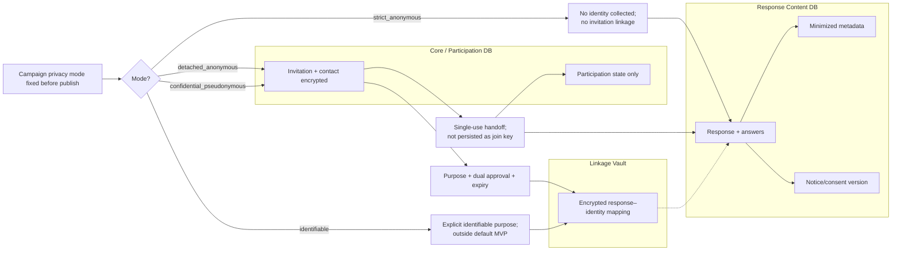
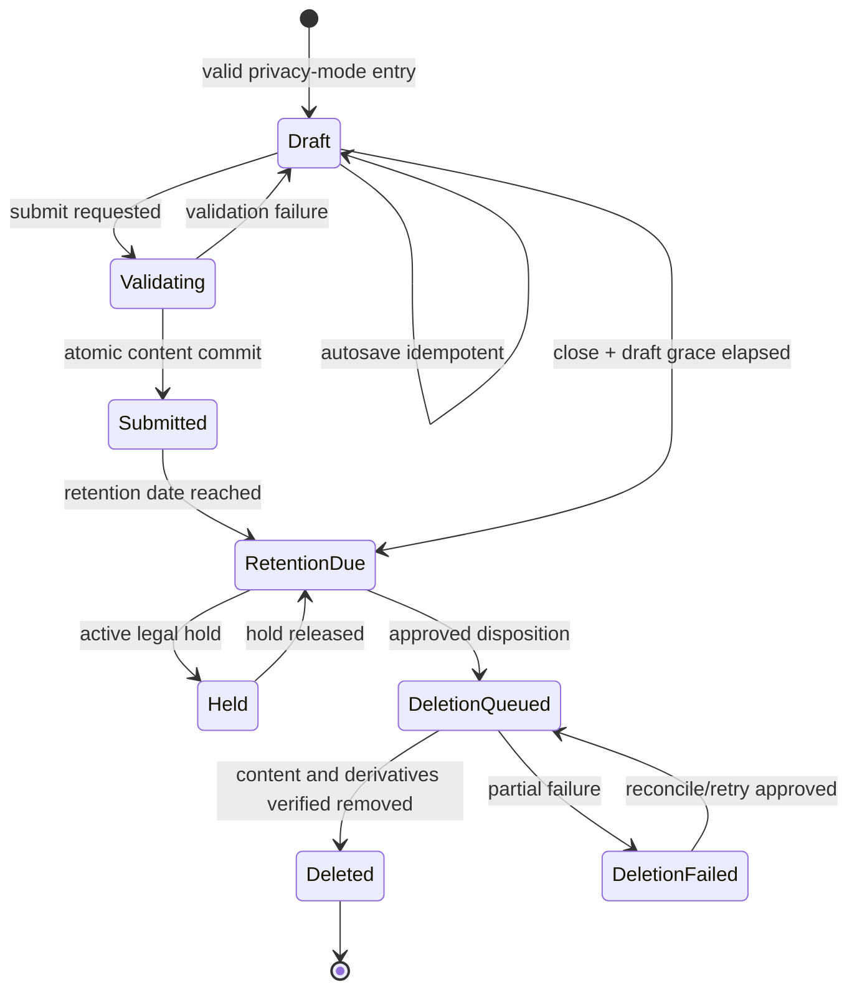
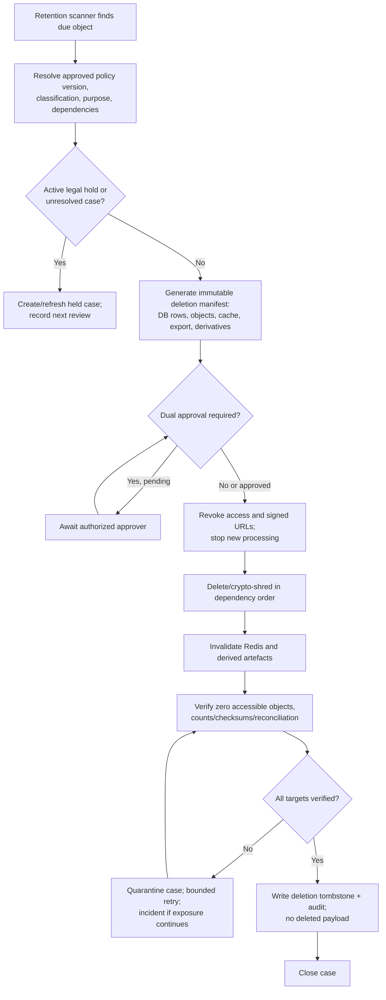
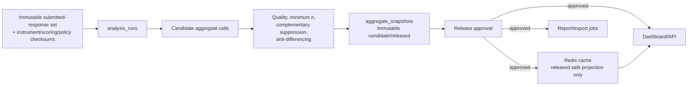
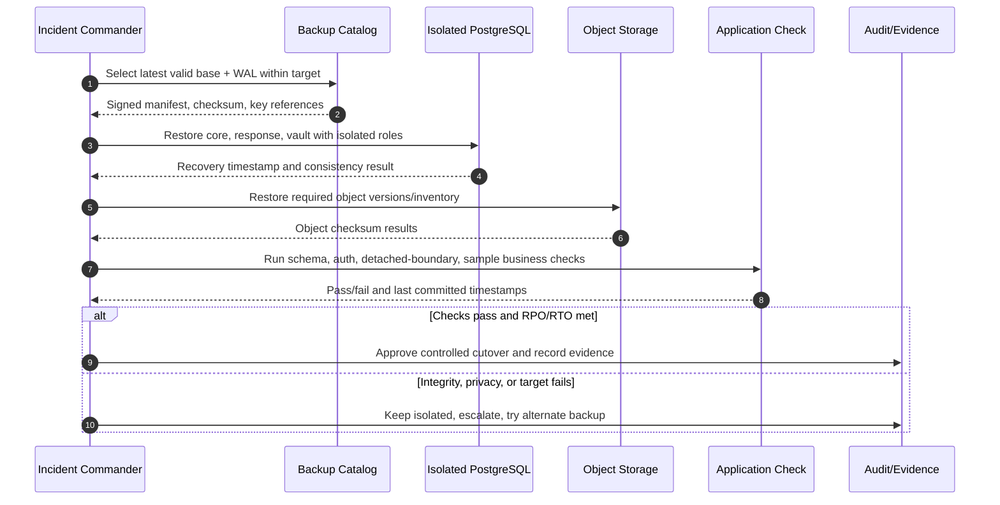

# Data Lifecycle, Retention, Archive, and Recovery

Versi: **1.0 — 2026-08-07**  
Status: retention/RPO/RTO bertanda `[P]` adalah **PROPOSED** dan memerlukan persetujuan LPMPP, fungsi PDP/hukum, TIK, serta auditor.

## 1. Lifecycle principles

1. Collect minimum data for an approved purpose and privacy mode.
2. Separate participation identity, response content, confidential linkage, aggregate, and audit evidence.
3. Freeze campaign policy/instrument/scoring versions before collection.
4. Release aggregate only after quality, minimum-cell, complementary suppression, and approval checks.
5. Retain by data class/purpose, not “forever by default”.
6. Archive is still processing: encryption, access, hold, and deletion rules continue to apply.
7. Deletion is a verified workflow across database, object, cache, export, backup-expiry, and derived data—not a single SQL statement.

## 2. Privacy-mode data paths

### Mode invariants

| Mode | Permitted | Forbidden | Claim shown to respondent |
|---|---|---|---|
| Strict anonymous | campaign ID, nonidentifying receipt, minimized answer context | login-linked subject, invitation ID, IP/user-agent, fingerprint, linkage vault row | anonim only after technical/privacy verification |
| Detached anonymous-content | Core knows invited/completed; content knows campaign only | persisted invitation–response key, shared correlation ID/log timestamp detail usable for joining | jawaban anonim; partisipasi dilacak terpisah |
| Confidential pseudonymous | encrypted linkage in vault for approved purpose/time | general admin/analyst access, unbounded retention, AI transfer of identity | rahasia, not anonymous; linkage purpose disclosed |
| Identifiable | direct follow-up when lawful/necessary and explicit | using ordinary quality survey notice to imply anonymity | identifiable and consequences explicitly disclosed |

Timestamp in participation/audit view is coarsened where operationally acceptable. Cross-store operator screens must not show aligned fine-grained timestamps. Application/edge logs use store-specific correlation IDs and redact token/query/payload.

## 3. Response lifecycle

Submitted responses are immutable. A correction policy, if later approved, creates a superseding response/version with an explicit relationship that must respect the campaign privacy mode; silent updates are forbidden.

## 4. Retention schedule

| Dataset | Retention target | Disposition | Hold/exception |
|---|---:|---|---|
| Published public summary | permanent according to archive policy `[P]` | integrity-checked public archive | correction creates superseding publication |
| Approved template/version | active + 10 years after retired `[P]` | archive then delete if no regulatory hold | accreditation/legal hold |
| Draft template/review comment | 5 years after decision `[P]` | delete/retain decision evidence minimum | dispute/audit case |
| Validation/pilot evidence | 5 years `[P]` | encrypted archive or delete | ethics/accreditation hold |
| User/role/scope | active + 2 years `[P]` | deactivate, pseudonymize identifiers, retain minimum audit | investigation/legal hold |
| Participant/contact and participation state | ≤90 days after campaign close `[P]` | crypto-shred/delete core rows, retain aggregate delivery counts | approved rights/dispute case; never extend response linkage |
| Draft response | 30 days after campaign expiry/close `[P]` | delete content aggregate | legal hold only if lawful and technically compatible |
| Submitted closed-answer response | 5 years `[P]` | archive/deletion according to purpose review | accreditation/research/legal hold |
| Raw open text | 2 years; approved redacted derivative 5 years `[P]` | delete raw first; keep vetted derivative only | approved case with owner/expiry |
| Sensitive/rare attributes | ≤5 years or shorter purpose limit `[P]` | remove field/row and recompute derived release as required | narrowly scoped hold |
| De-identified analytic dataset | purpose expiry, maximum 1 year `[P]` | workspace deletion + access revocation | approved reproducibility package excluding direct/quasi identifiers |
| Analysis lineage/aggregate/finding/action | 10 years `[P]` | archive; retain released evidence | accreditation/legal hold |
| Suppressed intermediate cell | purge ≤30 days after report `[P]` | delete; released snapshot retains suppression marker/count policy only | no routine hold unless incident evidence |
| AI provider payload | target provider retention 0; local staging shortest practical `[P]` | immediate purge after governed result/evidence | provider incapable of zero retention is rejected unless exception approved |
| AI result | same as derivative analysis `[P]` | retain approved output + lineage; quarantine/reject output purged earlier | evaluation/incident case |
| Action evidence | 5–10 years by embedded class `[P]` | encrypted archive/delete | accreditation/legal hold |
| Audit/security logs | minimum 2 years `[P]` | immutable archive then delete | investigation/legal hold |
| Export file | signed link ≤24 hours; object purge ≤7 days `[P]` | revoke then delete object/key | no permanent convenience archive |
| Backup | 35-day rolling `[P]` | automatic expiry/crypto-erasure | isolated incident copy with explicit case/expiry |
| Deletion tombstone | 10 years `[P]` | retain object ID/hash, policy, outcome; never deleted payload | audit evidence |

Retention policy is versioned and snapped to campaign, while later legal minimum/maximum may override through an approved change. Shortening requires impact analysis; extending requires documented purpose and proportionality.

## 5. Retention and deletion workflow

Dependency order normally deletes/revokes: active export/link → provider/staging copy → cache → derived workspace/intermediate → answers/response aggregate → vault link → participation/contact → object key. Released aggregate may remain only when policy permits and re-identification risk remains below approved threshold.

### Data subject or correction request

- Privacy Officer first determines whether the system can identify the data under the stated mode.
- Strict/detached anonymous responses must not be re-identified to satisfy a request; explain the technical limitation in the notice.
- Confidential records use the Linkage Vault only within approved case scope. Search results are not exported wholesale.
- Deletion/rectification impact on aggregate is assessed; recompute/supersede report if material or legally required.

## 6. Archive and partition operations

### Archive states

`online → archive_candidate → manifest_verified → encrypted_archive → restore_tested → online_deleted → archive_expired → destroyed`.

Archive acceptance requires row/object count, schema version, checksums, encryption key reference, classification, owner, purpose, retention due, hold status, and successful sample restore. Moving a file to cheaper storage without this manifest is not an archive.

### Partition policy

- Time partitions are operational units, not privacy subjects; drop/detach only when every row shares disposition and no hold.
- Mixed-hold partition must be copied/filter-verified into a retained partition before deletion of eligible rows.
- Partition pruning/query plan and index health are measured before enabling response partitioning.
- Audit/notification/job partitions can be monthly; create two future partitions and alert before default partition grows.

## 7. Aggregate snapshot and cache model

### Snapshot rules

- One snapshot cell is identified by run, canonical dimension key, metric code, and release version.
- It stores eligible/valid/missing counts, metric with full precision, rounding/policy versions, quality label, and suppression state/checksum.
- A released snapshot is immutable; recomputation creates a new analysis run and superseding release.
- Candidate/suppressed values never enter released cache. Complementary suppression runs over the complete table, not per endpoint.
- Cache key includes release ID, role-view class, organizational scope hash, locale, and format version. It never includes user email, raw filter text, or raw response ID.
- TTL is performance-only. Correctness/invalidation uses released snapshot version; cache miss reads the same durable safe projection.
- Query combinations are allowlisted and rate-limited to reduce differencing. Repeated query audit detects inference patterns.

## 8. Backup architecture

| Asset | Backup method | Frequency/retention | Encryption and isolation | Restore proof |
|---|---|---|---|---|
| PostgreSQL core/response/vault | daily full/base backup + continuous WAL/incremental | WAL gap ≤15 min; 35 days rolling `[P]` | separate failure domain; independent backup credential; KMS envelope | quarterly point-in-time restore to isolated environment |
| Object storage | versioning/object lock where approved + inventory backup | daily inventory; retention follows embedded data | private bucket, SSE-KMS/client encryption for R/S | restore sampled evidence/export plus checksum |
| Configuration | versioned non-secret config export + infrastructure definition | each approved change | signed/encrypted repository/storage | recreate clean environment and compare config hash |
| Secret/KMS | provider-native backup/HA and escrow policy | per provider/institution policy | never export plaintext into application backup | controlled key recovery/rotation drill |
| Redis | no authoritative backup required | none for business truth | protected in transit/at rest as available | flush and rebuild cache/queue from DB outbox/job ledger |

Backups inherit the highest data classification they contain. Backup logs store job ID, time, size, checksum, key reference, and outcome—not database rows, secret, or command arguments containing credentials.

## 9. Restore, RPO, and RTO

Baseline targets from Phase 04:

- **RPO ≤15 minutes `[P]`** for authoritative PostgreSQL data.
- **RTO ≤4 hours `[P]`** for core login, campaign access, autosave/submit, and essential administration.
- Availability target **≥99.5% monthly `[P]`**, excluding approved maintenance ≤4 hours/month.

### Restore runbook gates

1. Declare incident, scope, authority, and clean isolated destination.
2. Verify backup signature/checksum/key availability before restore.
3. Restore databases without enabling external traffic; apply WAL to selected consistent point.
4. Restore object inventory and verify references/checksums; never silently drop missing evidence.
5. Run migrations only if the restored application version requires and the tested runbook specifies them.
6. Validate counts, FK/invariants, instrument/run checksum, detached boundary, permissions, suppression, and sample workflows.
7. Rebuild Redis/cache and re-enqueue durable pending jobs; do not replay completed side effects.
8. Rotate credentials if compromise is suspected; enable traffic progressively.
9. Record achieved RPO/RTO, data loss window, exceptions, and reconciliation tasks.

A “backup job succeeded” message is not restore evidence. Quarterly drill must restore at least one randomized recovery point through application-level checks.

## 10. Recovery priorities

| Priority | Capability | Dependency |
|---:|---|---|
| P0 | identity/policy, core DB integrity, response submit/autosave for active campaign | DB, app, edge, KMS; Redis if session/queue required |
| P1 | campaign administration, participation, audit, queue reconciliation | core DB, Redis/outbox |
| P2 | analysis/snapshot/dashboard | response/core DB, workers |
| P3 | export, email retry, evidence object | storage/provider |
| P4 | AI | all governance gates and approved provider; may remain disabled |

Security/privacy containment outranks availability. A restore that breaks detached anonymity, permission scope, or suppression must not be cut over merely to meet RTO.
