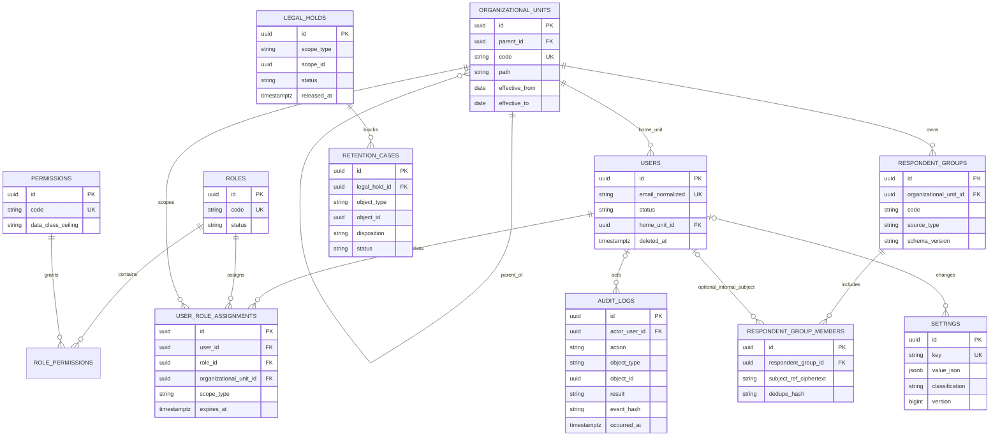
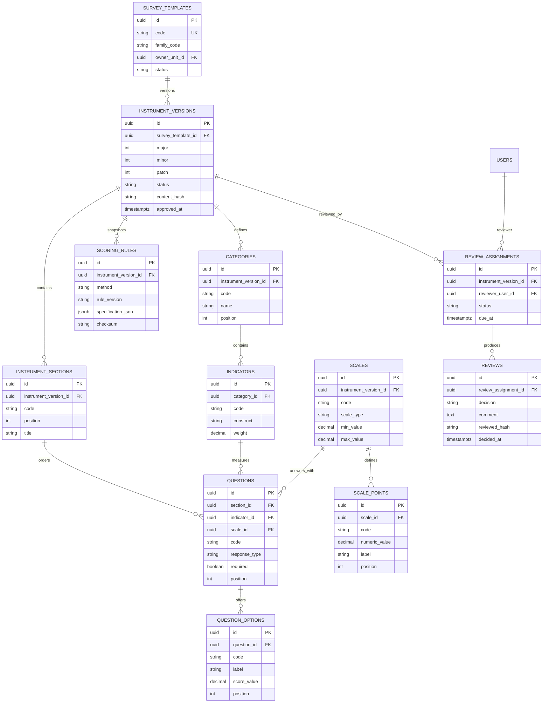
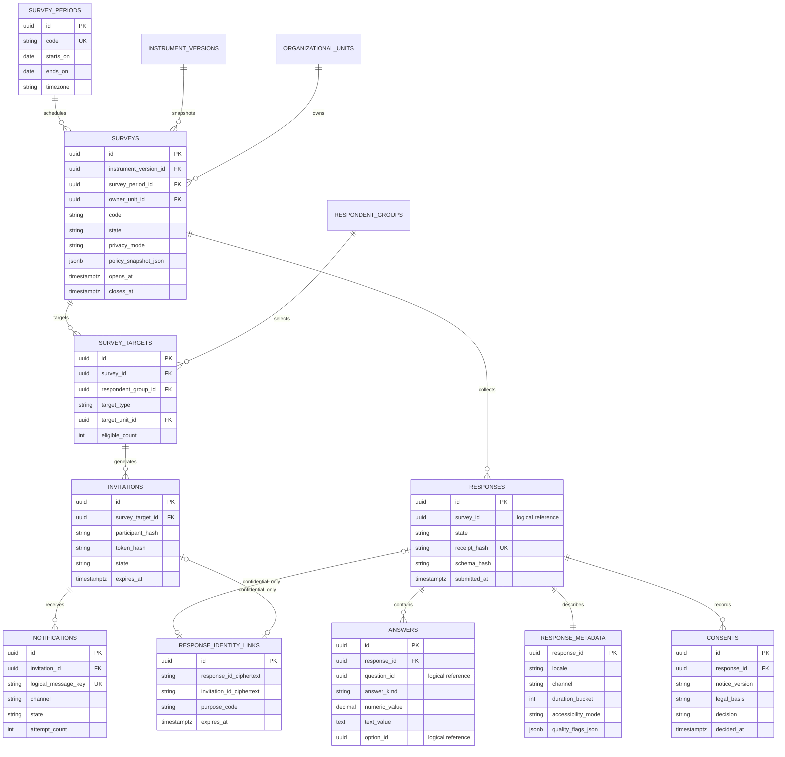
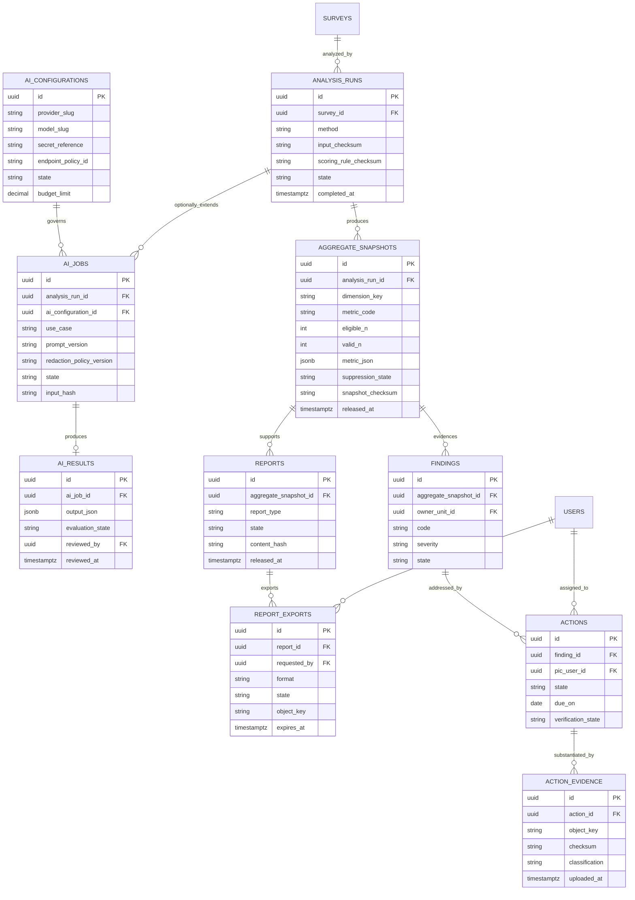
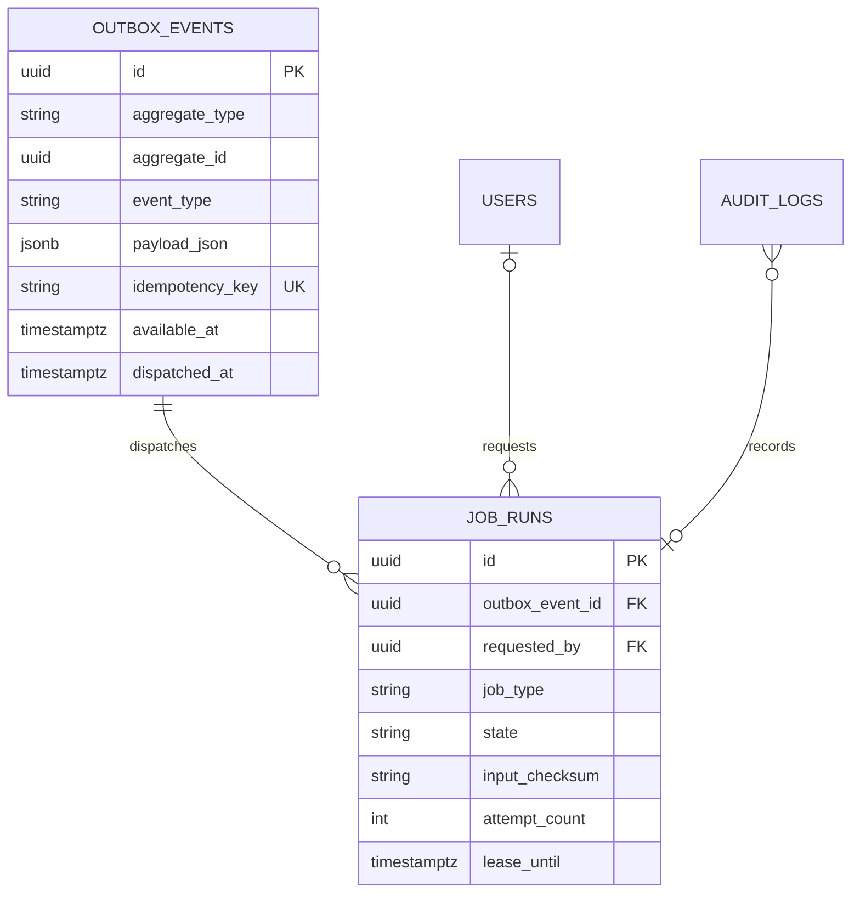

# Entity–Relationship Design

Versi: **1.0 — 2026-08-07**  
Status: **logical/physical baseline; migrations belum dibuat**

## 1. Modeling conventions

- Nama tabel fisik memakai `snake_case` plural; diagram memakai uppercase.
- Primary key domain memakai PostgreSQL `uuid` berisi UUIDv7. ID tidak menjadi authorization control.
- Waktu memakai `timestamptz`; period/calendar juga menyimpan timezone IANA pada survey.
- Mutable aggregate memakai `lock_version bigint` untuk optimistic concurrency.
- Published/released records immutable; koreksi menghasilkan version/run/snapshot baru.
- `created_by`/`updated_by` adalah audit actor reference dan umumnya `ON DELETE SET NULL`; audit event tetap mempertahankan actor snapshot/hash minimum.
- Tidak ada FK lintas database. Reference lintas `core`, `response`, dan `linkage_vault` disebut **logical reference** dan diverifikasi application invariant/reconciliation.
- JSONB hanya untuk versioned configuration/metric payload yang bentuknya metode-dependent; relationship, scope, identity, dan status utama tetap relational.

## 2. Entity coverage

| Domain | Entities |
|---|---|
| Identity/organization | `users`, `roles`, `permissions`, `role_permissions`, `user_role_assignments`, `organizational_units`, `respondent_groups`, `respondent_group_members` |
| Instrument | `survey_templates`, `instrument_versions`, `instrument_sections`, `categories`, `indicators`, `scales`, `scale_points`, `questions`, `question_options`, `scoring_rules`, `review_assignments`, `reviews` |
| Campaign/participation | `survey_periods`, `surveys`, `survey_targets`, `invitations`, `notifications` |
| Response/privacy | `responses`, `answers`, `response_metadata`, `consents`, `response_identity_links` |
| Analytics/AI/reporting | `analysis_runs`, `aggregate_snapshots`, `ai_configurations`, `ai_jobs`, `ai_results`, `reports`, `report_exports` |
| PPEPP/governance | `findings`, `actions`, `action_evidence`, `audit_logs`, `settings`, `outbox_events`, `job_runs`, `retention_cases`, `legal_holds` |

Seluruh entity minimum pada prompt tercakup. “Metadata” diwujudkan sebagai `response_metadata`; `periods`, `targets`, `options`, `evidence`, `exports`, dan `actions` menggunakan nama fisik yang lebih eksplisit di atas.

## 3. ERD — Identity, organization, and governance

`subject_ref_ciphertext` tidak menyimpan credential atau response ID. Untuk population external, nilai identitas terenkripsi dan dedupe HMAC berada di core/participation boundary serta dihapus menurut retention.

## 4. ERD — Instrument, validation, and scoring

Urutan section/question dan kode category/indicator unik di dalam version parent. Saat version memasuki review, `content_hash` dibekukan; approved/published version tidak di-update atau di-cascade-delete.

## 5. ERD — Campaign, participation, response, and consent

Garis `INVITATIONS → RESPONSE_IDENTITY_LINKS → RESPONSES` hanya berlaku bagi mode **confidential pseudonymous** dan merupakan logical reference terenkripsi di Linkage Vault, bukan FK cross-database. Pada `detached_anonymous`, tidak ada row Linkage Vault dan tidak ada persisted relation invitation–response. `response_metadata` dilarang memuat IP, raw user-agent, exact device fingerprint, contact, atau correlation ID lintas store.

## 6. ERD — Analysis, AI, reporting, and PPEPP

## 7. ERD — Reliable asynchronous execution

Outbox payload hanya memuat object reference dan data minimum; raw response, token, secret, atau open text tidak boleh diletakkan dalam Redis payload.

## 8. Identifier strategy: UUIDv7 versus ULID

| Option | Decision |
|---|---|
| Auto-increment bigint | ditolak untuk public/domain ID karena mudah dienumerasi dan sulit digabung lintas store; boleh untuk private sequence teknis bila terbukti perlu |
| ULID `char(26)` | valid dan sortable, tetapi menambah type/collation/casing discipline serta tidak memakai native PostgreSQL `uuid` |
| UUIDv4 | native dan acak, tetapi insert locality/index size behavior kurang baik dibanding time-ordered identifier |
| **UUIDv7** | **dipilih**: native PostgreSQL `uuid`, time-ordered, interoperable, dan tidak membawa MAC address |

Aturan:

- generate di application menggunakan cryptographically secure UUIDv7 implementation; database menolak `NULL`/duplicate;
- simpan native `uuid`, tampilkan lowercase canonical; jangan menerima variasi ID tanpa parser ketat;
- authorization selalu memeriksa scope/resource, sebab UUID bukan secret;
- invitation, password reset, receipt recovery, signed URL, dan idempotency credential memakai random token ≥256 bit; database hanya menyimpan HMAC/hash berpepper, bukan UUID;
- timestamp UUIDv7 tidak menggantikan `created_at`; ordering bisnis memakai kolom waktu eksplisit.

## 9. Foreign key and delete behavior

| Relationship class | FK behavior | Rationale |
|---|---|---|
| Draft-owned child (`section`, `question`, `option`) | `ON DELETE CASCADE` hanya selama parent draft dan unused | menghapus aggregate draft secara konsisten |
| Published/versioned instrument → child | hard delete ditolak oleh state guard; FK `RESTRICT` | menjaga reproducibility |
| Survey → target/invitation | `RESTRICT` setelah publication; draft unused boleh controlled cascade | mencegah hilangnya participation evidence |
| Response → answer/metadata/consent | `CASCADE` hanya melalui approved retention deletion transaction | satu privacy aggregate dibuang utuh |
| Analysis → snapshot/report/finding | `RESTRICT`; supersede/retire, bukan delete | released evidence tetap terlacak |
| Finding → action → evidence | `RESTRICT`; correction/version status | PPEPP evidence tidak hilang diam-diam |
| User actor reference | `SET NULL` setelah user deactivation/pseudonymization; audit actor snapshot/hash tetap | menghindari orphan dan mempertahankan assurance |
| Organization hierarchy | parent `RESTRICT` selama child aktif; effective-date/retire | tidak merusak scope historis |
| Cross-database reference | tidak ada physical FK; immutable ID + checksum + reconciliation | PostgreSQL tidak menyediakan FK lintas database |
| Legal hold target | deletion blocked application/policy layer; tombstone retained | legal/audit preservation |

Physical cascade tidak pernah menjadi satu-satunya privacy workflow: authorization, hold check, manifest, checksum, object deletion, dan tombstone harus berhasil/terekonsiliasi.

## 10. Uniqueness and indexing strategy

### Required unique constraints

- `roles(code)`, `permissions(code)`, `organizational_units(code)` pada active namespace;
- `role_permissions(role_id, permission_id)`;
- `user_role_assignments(user_id, role_id, scope_type, scope_id)` partial untuk assignment active;
- `survey_templates(owner_unit_id, code)`;
- `instrument_versions(survey_template_id, major, minor, patch)`;
- section/category/indicator/question/option `code` dan `position` unik dalam parent version;
- `surveys(code)` dan `(instrument_version_id, survey_period_id, owner_unit_id, code)` sesuai naming policy;
- `survey_targets(survey_id, respondent_group_id, target_unit_id)` dengan normalized nullable-key strategy;
- `invitations(survey_target_id, participant_hash)` dan `invitations(token_hash)`;
- `responses(receipt_hash)`, `answers(response_id, question_id)` untuk single-answer item; multi-select memakai `(response_id, question_id, option_id)`;
- `analysis_runs(survey_id, method, input_checksum, scoring_rule_checksum)` untuk reproducible logical run;
- `aggregate_snapshots(analysis_run_id, dimension_key, metric_code)`;
- `ai_results(ai_job_id)`, `notifications(logical_message_key)`, `outbox_events(idempotency_key)`;
- satu released report per `(aggregate_snapshot_id, report_type, release_version)`.

### Query indexes

| Query | Index baseline |
|---|---|
| Effective user grants | `(user_id, expires_at)` partial where active; `(scope_type, scope_id)` |
| Unit subtree | materialized path/`ltree` setelah extension approval; baseline `(parent_id, effective_to)` |
| Campaign list/state | `(owner_unit_id, state, opens_at desc)` dan `(state, closes_at)` |
| Invitation dispatch | partial `(state, expires_at)`; token hash unique |
| Autosave/response | `(survey_id, state, updated_at)`; `responses(id)` PK; avoid indexing raw text |
| Answer aggregation | `(question_id, response_id)` dan BRIN/B-tree decision setelah actual plan |
| Snapshot dashboard | `(analysis_run_id, dimension_key, metric_code, suppression_state)` |
| Queue/outbox | partial `(available_at, id)` where `dispatched_at is null`; `(state, lease_until)` |
| Audit search | `(occurred_at desc)`, `(object_type, object_id, occurred_at desc)`, `(actor_user_id, occurred_at desc)` |
| Retention | partial `(retention_due_at)` where disposition pending |

Index ditambah hanya berdasarkan query plan/slow-query evidence. JSONB GIN tidak dibuat default; buat expression/GIN index hanya pada key yang mempunyai query contract stabil. PII/open text tidak diindeks untuk convenience.

## 11. Partition and archive strategy

- MVP: `responses`, `answers`, dan core domain tetap non-partitioned sampai volume/query plan membuktikan kebutuhan. Premature partitioning memperumit unique/FK/retention.
- `audit_logs`, `notifications`, dan `job_runs` layak monthly range partition saat retention/volume aktif karena append-heavy dan time-bounded deletion; partition masa depan dibuat sebelum boundary waktu.
- Revisit response partitioning bila salah satu terjadi: >50 juta answer rows, maintenance/vacuum tidak memenuhi window, index > RAM budget, atau p95 analysis tidak memenuhi NFR setelah query/index tuning.
- Candidate bila trigger terpenuhi: range by `submitted_month` pada response dan co-located answer partitioning setelah proof-of-concept memastikan global uniqueness/FK/retention.
- Closed campaign raw content melewati retention workflow ke encrypted archive atau deletion; dashboard historis membaca immutable aggregate snapshot, bukan mengaktifkan kembali raw archive.
- Archive manifest memuat object/table range, row count, schema/policy version, checksum, class, retention due, encryption key reference, dan restore test evidence.
