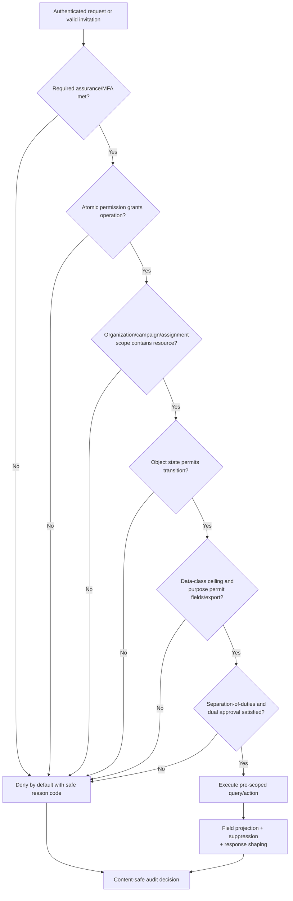
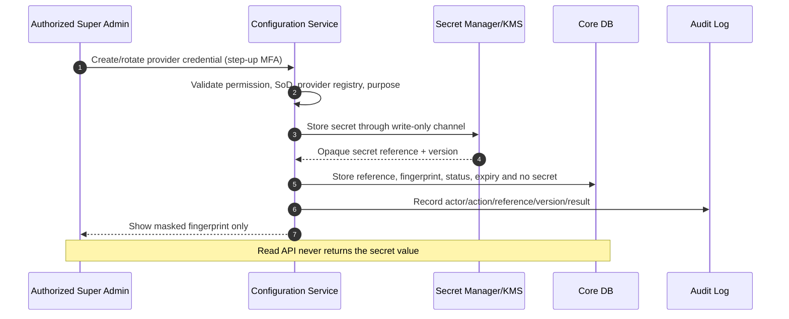

# Security and Privacy Architecture

Versi: **1.0 — 2026-08-07**  
Status: **security baseline; environment-specific controls require implementation and verification in later phases**

## 1. Security objectives and trust zones

| Objective | Required property |
|---|---|
| Confidentiality | raw response, identity, linkage, secret, and exports accessible only for approved purpose/scope |
| Integrity | instrument versions, response submission, analysis lineage, evidence, audit, and releases are tamper-evident |
| Availability | core collection survives noncritical provider failure; recovery is measured and tested |
| Unlinkability | anonymous content cannot be joined to participant identity through persisted keys or routine logs |
| Accountability | privileged/security/business-critical actions have immutable, content-safe audit evidence |
| Transparency | privacy mode, use, retention, AI involvement, and rights/limitations are stated before consent/submit |

Trust zones:

1. Browser/untrusted network.
2. Web edge and first-party application.
3. Core/participation data zone.
4. Response content zone.
5. Linkage Vault and secret/KMS zone.
6. Asynchronous worker zone.
7. External provider/Internet egress zone.
8. Backup/administration zone.

Cross-zone traffic is authenticated, encrypted, allowlisted, minimized, and logged without payload.

## 2. Authentication and session architecture

- First-party Vue/Filament browser flow uses server-side session cookies: `Secure`, `HttpOnly`, `SameSite=Lax/Strict` as flow permits; session ID rotated after login/privilege change.
- CSRF token is required for state change; CORS does not replace CSRF protection.
- Administrative roles require MFA. Step-up MFA is required for secret rotation, raw export exception, linkage-vault access, deletion/hold release, and high-risk policy changes.
- SSO adapter validates issuer, audience, signature, nonce/state, time, and account status. No password replication when SSO is authoritative.
- Local emergency account, if approved, is disabled by default, KMS-backed, monitored, time-bound, and cannot bypass data scope.
- Session registry supports revoke all, inactivity/absolute expiry, device/session listing at safe granularity, and privileged-session reauthentication.
- Invitation/receipt/password-reset tokens are ≥256-bit random; database stores HMAC/hash with secret pepper. Token appears only in HTTPS fragment/query where unavoidable, is redacted from access/referrer logs, single-use, and short-lived.

## 3. Authorization architecture

### Enforcement layers

| Layer | Enforcement |
|---|---|
| Route/middleware | authentication, CSRF, rate limit, minimum assurance, coarse feature gate |
| Laravel policy/action | resource permission, object state, assignment, purpose, SoD, classification ceiling |
| Query scope | organizational descendant/campaign/assignment filters applied before fetch/count; no post-fetch filtering |
| Field serializer/resource | allowlisted projection by data class and purpose |
| Database role | separate core/response/vault/worker credentials; no application superuser; grant only needed tables/verbs |
| Release boundary | suppression and report/export approval independent of ordinary read permission |
| Audit | decision, policy/grant version, scope hash, result, correlation ID; no raw content/secret |

Effective permission formula:

`allow = authenticated_assurance ∩ atomic_permission ∩ active_scope ∩ assignment_or_purpose ∩ object_state ∩ data_class_ceiling ∩ separation_of_duties`.

No component may convert `deny` into broad fallback. Super Admin manages technology and grants but has no implicit raw-response/open-text/linkage access. Pimpinan/PIC receive released aggregates and assigned workflow only. Analyst raw/de-identified access requires explicit purpose/time-bound grant; raw export requires dual approval.

### Database defense-in-depth

- Application database users are non-owner, non-superuser, cannot `BYPASSRLS`, install extensions, create FDW/dblink, or alter audit triggers/policies.
- Separate database roles/connections: `app_core_rw`, `app_response_rw`, `worker_analysis_ro`, `worker_snapshot_rw`, `vault_case_rw`, `audit_append`, `backup_restore`.
- PostgreSQL RLS may be used for stable high-risk tables only after connection-pooling/session-context tests; application policy/query scope remains mandatory. RLS is not claimed implemented in Phase 06.
- Linkage Vault role is issued only to a dedicated case worker process/command with short-lived credential; ordinary web process has no vault credential.

## 4. Input, browser, and API controls

- Server validates type, length, enum, cardinality, cross-field rules, state, and file signatures; client validation is usability only.
- Output encoding follows context; rich text is not allowed unless sanitized by an approved allowlist. Vue raw HTML rendering is prohibited for user content.
- Eloquent/parameterized SQL only; dynamic sort/filter maps external names to fixed columns/operators.
- API errors return safe code, user action, and correlation ID; no stack trace, SQL, token, secret, raw provider response, or another participant identifier.
- Security headers: HSTS in production, CSP with nonces/hashes, `frame-ancestors`, `nosniff`, strict referrer policy, permissions policy, and cache-control for sensitive pages/files.
- Rate limits are keyed by trusted account/invitation plus coarse network signal; raw IP is retained only in separate security telemetry per policy, never response dataset.
- Autosave/submit use body size limits, optimistic revision, idempotency token, and atomic typed-answer validation.

## 5. Encryption architecture

### In transit

- TLS 1.2+ baseline externally; TLS 1.3 preferred. HSTS enabled after HTTPS-only validation.
- PostgreSQL/Redis/provider/storage/KMS traffic crossing process/host trust boundary uses authenticated TLS.
- Certificate validation cannot be disabled. Custom CA is installed through controlled trust store, never `verify=false`.

### At rest and field level

| Data | Control |
|---|---|
| PostgreSQL volumes/backups | encrypted storage + encrypted backup in separate failure domain |
| Object evidence/export | per-object encryption with KMS key reference; private bucket; versioning/checksum |
| Contact/population fields | authenticated envelope encryption; deterministic HMAC blind index only for approved dedupe |
| Linkage Vault mapping | separate KEK/policy/role; short-lived decrypt; key version stored, key material external |
| Provider API key/secret | secret manager only; database stores opaque reference + nonreversible fingerprint |
| Password | Argon2id/adaptive one-way hash; never reversible encryption |
| Invitation/receipt/reset token | HMAC-SHA-256 or equivalent with secret pepper; compare constant-time |
| Open-text/AI staging | encrypted storage; strict TTL; access purpose-bound; provider transfer after redaction only |

Envelope encryption uses a data-encryption key (DEK) protected by a key-encryption key (KEK) in institutional KMS/HSM/secret manager. Ciphertext metadata includes algorithm/version/key reference/nonce/tag; it never includes KEK/DEK plaintext.

## 6. Key and secret management

Rules:

- Secrets are injected/resolved at runtime from an approved manager; `.env` is development-only and never committed or displayed.
- UI uses write-only input. Update means replace/rotate, never reveal. Copy/export is prohibited.
- Separate keys by environment, data purpose, and high-risk zone. Production key cannot decrypt nonproduction copies and vice versa.
- Rotation has owner, maximum age per credential class, overlap window, rollback reference, verification, and audit. Suspected exposure: disable feature, revoke/rotate ≤24 hours, contain logs/backups, investigate.
- Key deletion/crypto-shredding requires approved retention manifest, legal-hold check, dual control, and proof that no retained data still needs the key.
- Logs/metrics/traces scan and redact keys named token, secret, authorization, cookie, password, key, prompt, answer, and provider payload.

## 7. Provider endpoint and SSRF protection

There is **no free-form custom Base URL** in ordinary settings. `ai_configurations.provider_slug` references a versioned provider registry controlled by TIK/security. Initial adapters use fixed official HTTPS endpoints.

If an institutional custom endpoint is later required, all controls below are mandatory:

1. Change request and dual approval create exact `scheme + host + port + path-prefix` allowlist; only `https`, default/explicit approved port, no URL userinfo, fragments, wildcard host, or arbitrary path.
2. Parse with one canonical URL library; reject ambiguous/encoded host, decimal/octal/hex IP, mixed slash, control characters, and invalid IDN. Store normalized registry entry, not user request URL.
3. Resolve all A/AAAA answers immediately before connect; reject loopback, private, link-local, multicast, reserved, documentation, carrier-grade NAT, IPv4-mapped IPv6, and cloud metadata ranges. Revalidate every retry.
4. Disable redirects. If a provider requires redirect, each hop must independently pass the same allowlist/DNS/IP checks and preserve no credentials cross-origin.
5. Egress proxy/firewall allows only registry destination/port and blocks internal networks/DNS rebinding path; application process has no general Internet egress.
6. Connect to a validated resolution while preserving TLS hostname/SNI and normal certificate verification; cap DNS response count/TTL behavior and request/response size.
7. Apply connect/read/total timeout, bounded retry only for safe errors, circuit breaker, concurrency/token/cost limit, and response content-type/schema checks.
8. Strip hop-by-hop/client headers; never forward inbound `Authorization`, cookie, internal header, callback URL, or arbitrary tool/function URL.
9. Audit provider slug/model, normalized host, policy version, result, latency, token/cost, and request/response hashes—not secret or raw prompt/output.

These controls follow the [OWASP SSRF Prevention Cheat Sheet](https://cheatsheetseries.owasp.org/cheatsheets/Server_Side_Request_Forgery_Prevention_Cheat_Sheet.html); application allowlisting is reinforced by network egress policy because either layer alone can fail.

## 8. File, object, and export security

- Upload requires purpose, size, extension and detected media type agreement, safe filename replacement, malware scan, decompression limits, and checksum.
- Object keys are random, not original filenames or participant identifiers. Buckets are private; directory listing/public ACL is denied.
- HTML/SVG/script-capable content is rejected or served as attachment from isolated origin after sanitation policy.
- Downloads re-check current permission, scope, classification, release/revocation, and expiry; signed URL is one-time/short-lived and never an authorization substitute.
- Exports are generated only from released suppressed snapshot unless a raw-export exception has dual approval, purpose, recipient, field allowlist, watermark, expiry, and enhanced audit.
- Export object expires ≤7 days `[P]`; link ≤24 hours `[P]`; revoked policy/report invalidates future download.

## 9. Logging, audit, and monitoring

Audit events cover admin login, grant/policy/secret change, review/publish, campaign state, analysis, AI, release, export generation/download/revoke, linkage-vault case, retention/deletion, hold, restore, and verification.

Required fields: event ID, UTC timestamp, actor type/ID or pseudonymized snapshot, assurance, action, object type/ID, scope/policy version hash, result, safe reason code, correlation ID, before/after hash for change, and event/chain hash. Forbidden: password, API key, token, cookie, full request/response, raw answer/open text, contact, decrypted linkage, provider payload.

Operational metrics use bounded labels to prevent PII/cardinality leakage. Alerts include privilege escalation, vault access, repeated denied raw queries, unusual export volume, differencing patterns, secret scan hit, audit-chain gap, backup/WAL gap, restore failure, queue lag, and provider budget/circuit state.

## 10. Privacy engineering controls

| Risk | Architectural control |
|---|---|
| identity-content linkage | separate DB/credential, no persisted key for anonymous modes, log separation/coarsening |
| small-cell disclosure | minimum-cell + complementary suppression + anti-differencing before release/cache |
| quasi-identifier inference | field allowlist, coarsening, rare-combination review, public threshold higher |
| purpose creep | campaign policy snapshot, purpose-bound grant/export/AI case, expiry |
| excessive retention | due-date per record/class, daily disposition, legal hold, deletion evidence |
| administrator abuse | SoD, dual approval, no implicit Super Admin raw access, vault short lease, immutable audit |
| analytics workspace copy | time-bound de-identified dataset, controlled workspace, no local download by default |
| AI disclosure | redaction/threshold, fixed provider registry, zero-retention target, human review |

Privacy notice must truthfully distinguish anonymous, detached anonymous-content, confidential pseudonymous, and identifiable processing. A mode cannot be upgraded to a less private one after responses exist.

## 11. Verification baseline

- automated authorization matrix with negative tests for role, scope, assignment, state, classification, and SoD;
- schema test proving forbidden columns/FKs absent from anonymous Response DB;
- secret scan of repository/image/log/API/export and rotation drill;
- SSRF fixtures including private IPv4/IPv6, metadata, redirect, DNS rebinding, IDN/encoded host;
- CSRF/session/header/TLS and dependency/container scan;
- file polyglot/zip-bomb/media mismatch and signed-URL expiry/revocation tests;
- golden suppression parity across dashboard/API/export plus differencing abuse tests;
- audit-event coverage/immutability/chain verification;
- backup restore and lost-Redis rebuild exercise.

Targets requiring approval remain labeled `[P]`; no production readiness claim is made until controls are implemented and evidence passes.
