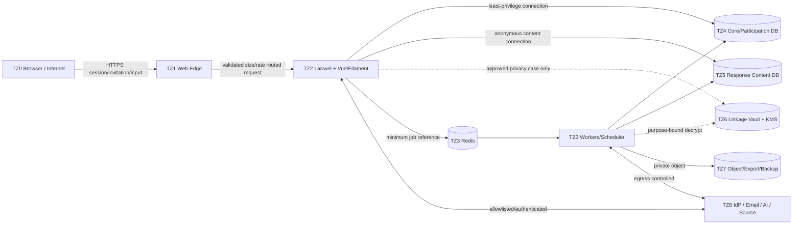

# Threat Model — STRIDE

Versi: **1.0 — 2026-08-07**  
Status: **design-time threat model; residual ratings require owner/risk-appetite approval and implementation testing**

## 1. Scope, assets, and assumptions

In scope: browser, Nginx edge, Vue, Laravel/Filament, workers/scheduler, Redis, Core DB, Response DB, Linkage Vault, object/export/backup storage, IdP, email, source imports, AI/KMS/provider egress, and operator access.

Primary assets:

- participant identity/contact and invitation token;
- response content, open text, quasi-identifiers, consent, and privacy-mode truth;
- role/grant/scope/policy, admin session, secret/key material;
- approved instrument/scoring/policy versions and analysis lineage;
- aggregate suppression state, reports/exports, findings/actions/evidence;
- audit chain, backup/WAL, restore authority, AI prompt/result/evaluation.

Assumptions: one institution; public Internet respondents; admin requires MFA; AI disabled by default; no production topology has been approved. Threat actors include unauthenticated Internet users, malicious/compromised respondent, compromised internal account, curious/rogue admin, compromised provider/dependency, and operator error.

## 2. Trust-boundary data-flow view

Every arrow is a trust crossing unless both endpoints share the same controlled process/runtime. Trust is not inherited from being “internal”.

## 3. Risk method

Likelihood and impact use `1 Low`, `2 Medium`, `3 High`. Inherent score = `L × I`: 1–2 Low, 3–4 Medium, 6 High, 9 Critical. Residual is a target after all listed controls pass; it is not current measured risk.

STRIDE: Spoofing, Tampering, Repudiation, Information disclosure, Denial of service, Elevation of privilege.

## 4. Threat register

| ID | STRIDE | Asset/flow | Threat scenario | L×I | Required controls | Verification | Residual target/owner |
|---|---|---|---|---:|---|---|---|
| TM-S-01 | S | Admin session | Credential/session theft impersonates Admin/Super Admin | 3×3=9 | MFA, secure cookie, rotation, expiry, revoke, step-up, anomaly alert | session fixation/theft and MFA bypass tests | M / TIK Security |
| TM-S-02 | S | Invitation | Attacker guesses/reuses invitation or receipt token | 2×3=6 | ≥256-bit token, HMAC storage, single-use/expiry, rate limit, constant-time compare, log redaction | entropy, replay, expiry, enumeration tests | L / App Owner |
| TM-S-03 | S | IdP callback | Forged/replayed OIDC/SAML response creates session | 2×3=6 | issuer/audience/signature/nonce/state/time/account validation | malformed/replay/wrong-audience fixtures | L / TIK Identity |
| TM-S-04 | S | Worker/provider | Fake provider endpoint or DNS rebinding receives secret/data | 2×3=6 | fixed provider registry, TLS, DNS/IP validation, no redirects, egress allowlist | SSRF/DNS rebinding/certificate tests | L / TIK Security |
| TM-T-01 | T | Instrument | Published items/scoring changed after collection | 2×3=6 | immutable versions, hash, state guard, approval, audit | direct DB/app mutation and rerun test | L / LPMPP |
| TM-T-02 | T | Response | Autosave replay/concurrency overwrites newer answer | 3×2=6 | revision/lock_version, idempotency key, atomic typed writes | concurrent/reordered request test | L / App Owner |
| TM-T-03 | T | Submit | Duplicate/partial cross-store submit corrupts completion | 2×3=6 | one-time handoff, atomic content commit, receipt, no persisted join, reconciliation | timeout at every boundary, exactly-once invariant | M / App Owner + Privacy |
| TM-T-04 | T | Queue/outbox | Job replay sends duplicate email/export or releases partial result | 3×2=6 | durable idempotency key, job ledger/lease, unique business constraints, quarantine | Redis flush/replay/concurrent worker tests | L / Operations |
| TM-T-05 | T | Evidence/export | Object replaced after verification/release | 2×3=6 | private versioned object, checksum, immutable metadata, download check | replace/version/checksum mismatch test | L / TIK Storage |
| TM-T-06 | T | Audit | Privileged actor edits/deletes evidence of actions | 2×3=6 | append-only role, hash chain, separate archive, alert | update/delete privilege test and chain verification | M / Auditor |
| TM-R-01 | R | Approval/export | Actor denies approving/releasing/downloading sensitive file | 2×3=6 | MFA assurance, actor/session, policy hash, timestamp, object checksum, immutable audit | event coverage and nonrepudiation review | L / Auditor |
| TM-R-02 | R | Anonymous submit | System cannot prove safe outcome after partial submit without linking identity | 2×2=4 | respondent receipt, content-safe state evidence, user-assisted recovery, no operator join | induced ack failure and recovery drill | M / Privacy Owner |
| TM-R-03 | R | Provider | Provider billing/result disputed | 2×2=4 | request/output hashes, model/prompt/policy versions, token/cost, provider request ID hash | ledger reconciliation to invoice/sample | L / AI Use-case Owner |
| TM-I-01 | I | Response DB | Identity inferred via direct/quasi identifiers or aligned timestamps | 3×3=9 | forbidden schema fields, coarsening, store/log separation, rare-combination review | automated schema/flow and re-identification exercise | M / Privacy Officer |
| TM-I-02 | I | Dashboard/export | Small cells/differencing reveal individual answer | 3×3=9 | minimum n, complementary suppression, query allowlist, rate/audit, parity snapshot | golden and adaptive differencing tests | M / LPMPP + Privacy |
| TM-I-03 | I | Open text | Respondent names self/others; raw text leaks in report/AI/log | 3×3=9 | R classification, redaction queue, no routine export, output scanning, threshold/human review | seeded PII/prompt-injection fixtures | M / Data Owner |
| TM-I-04 | I | Super Admin | Technical admin reads raw response or grants self access | 2×3=6 | no implicit permission, separate DB role, dual approval, no self-grant, alert | negative access/self-escalation test | L / Security + Auditor |
| TM-I-05 | I | Cache/Redis | Raw/suppressed data or secret stored in cache/queue payload | 2×3=6 | released safe projection only, minimum reference payload, TTL, scanner | Redis dump/key/payload inspection | L / App Owner |
| TM-I-06 | I | Logs/telemetry | Token, contact, prompt, answer, SQL/provider payload leaks | 3×3=9 | structured allowlist logging, redaction, bounded labels, restricted log access | seeded canary/secret scan | L / Operations |
| TM-I-07 | I | Backup | Backup/object copied or restored to insecure environment | 2×3=6 | encryption, separate credential/domain, restore isolation, inventory, access alert | unauthorized restore/access and key-separation drill | M / TIK Security |
| TM-I-08 | I | Linkage Vault | Purpose abuse or bulk linkage de-anonymizes survey | 2×3=6 | vault absent for anonymous mode, short credential, fixed case query, dual approval, expiry | bulk-query/ordinary-role denial test | M / Privacy + Auditor |
| TM-I-09 | I | AI provider | Prompt contains PII/small cell or provider retains/trains on data | 2×3=6 | use-case registry, redaction/threshold, zero-retention contract target, allowlist, DPA, no training, review | canary/PII/redaction/provider-setting evidence | M / AI Owner + Privacy |
| TM-I-10 | I | Secret config | API key returned by read API/UI, logged, or stored plaintext | 2×3=6 | write-only KMS, opaque ref/fingerprint, masking, secret scan/rotation | DB/API/UI/log scan with seeded key | L / TIK Security |
| TM-D-01 | D | Respondent API | Bot floods survey/autosave/submit or oversized payload | 3×2=6 | edge/app rate/body limits, token/account quotas, queue separation, DB bounds | load/abuse and large-payload test | M / Operations |
| TM-D-02 | D | Redis/queue | Queue flood/starvation delays critical submit/reconciliation | 2×3=6 | queue classes/quotas, backpressure, worker limits, DB outbox, alerts | poison/flood and recovery test | M / Operations |
| TM-D-03 | D | AI/email | Slow/429/5xx provider exhausts worker/connections/budget | 3×2=6 | timeout, bounded retry+jitter, circuit breaker, concurrency/cost cap, isolated queues | fault injection and budget ceiling test | L / Operations |
| TM-D-04 | D | Database | Expensive filters/analysis/export lock or exhaust DB | 2×3=6 | allowed query shapes, async jobs, statement timeout, indexes, read workload limits | explain/load/timeout and concurrent export tests | M / DBA |
| TM-D-05 | D | Storage | Upload bomb/malware fills storage or scanner | 2×3=6 | size/count/quota, streaming limit, decompression bound, malware quarantine | zip bomb/polyglot/quota test | L / TIK Storage |
| TM-E-01 | E | IAM | Role/scope manipulation or stale grant broadens access | 2×3=6 | governed assignment, expiry, no self-approve, cache versioning/revoke, quarterly review | grant matrix, stale-cache, descendant-scope tests | L / TIK + Data Owner |
| TM-E-02 | E | Object ID | IDOR accesses another unit/campaign/export/evidence | 3×3=9 | server-side scoped lookup, signed download plus current policy, negative tests | cross-unit/campaign/resource ID tests | L / App Owner |
| TM-E-03 | E | Filament | Bulk action/resource bypasses policy or field restriction | 2×3=6 | policy on resource/query/action, bulk per-object check, safe field schema | panel action/bulk/import/export authorization tests | L / App Owner |
| TM-E-04 | E | SSRF | Custom Base URL/provider tool reaches metadata/internal admin/KMS | 2×3=6 | no free-form URL, exact allowlist, parser/DNS/IP/redirect controls, egress firewall | private/metadata/IPv6/redirect/rebinding suite | L / TIK Security |
| TM-E-05 | E | Upload/content | Stored XSS/formula injection executes in admin/export recipient | 3×2=6 | output encoding, no raw HTML, CSV formula neutralization, isolated download origin | XSS/CSV formula/polyglot fixtures | L / App Owner |
| TM-E-06 | E | Dependencies/CI | Compromised image/package/CI secret changes production | 2×3=6 | lockfiles, verified images/SBOM, least-privilege CI, signed artefacts, scan/review | provenance/signature and injected dependency exercise | M / DevOps |

## 5. Privacy and AI abuse cases

| Abuse case | Prevention/detection | Safe response |
|---|---|---|
| Admin compares multiple overlapping slices to isolate one respondent | dimension allowlist, complementary suppression, privacy budget/rate, query audit | block query/release, review prior outputs, incident assessment |
| Analyst exports raw rows “for convenience” | raw export absent by default; purpose/field/time/recipient dual approval | deny; provide approved aggregate or controlled workspace |
| Campaign labelled anonymous while logs/vault permit linkage | privacy preflight/schema/log verification and signed mode declaration | block publication; relabel confidential only before responses |
| Respondent puts names/instructions in open text | warn, redaction, untrusted-content delimiters, human review | quarantine finding/output; do not send raw to AI/report |
| AI output invents finding or exposes prompt | evidence citations/input hash, evaluation, no auto-release, reviewer | reject/quarantine; statistics and PPEPP remain available |
| Cost-limit bypass by retries/model switch | atomic reservation ledger, per-job/use-case/month cap, idempotency | stop job/circuit; require new approval, no hidden retry |
| Deletion removes row but leaves export/cache/backup indefinitely | manifest spans derivative/object/cache; backup expiry ledger | revoke immediately, reconcile all copies, incident if accessible |

## 6. Control ownership and review triggers

| Owner | Primary responsibilities |
|---|---|
| LPMPP/Data Owner | instrument/campaign purpose, release/suppression, raw-access exception, findings |
| Privacy Officer | mode truth, linkage cases, retention/rights, re-identification, AI dataset approval |
| TIK Security | IAM/MFA, keys/secrets, SSRF/egress, vulnerability/incident, backup security |
| Operations/DBA | capacity, queue, DB/Redis/storage availability, restore evidence |
| AI Use-case Owner | registry, prompt/model/evaluation/budget, reviewer assignment, provider contract |
| Auditor | SoD, immutable evidence, grant/secret/deletion/restore review |

Threat model review is required before controlled pilot and whenever a trust boundary, privacy mode, provider, identity flow, raw export, public report, AI use case, retention rule, storage/backup topology, or material scale changes. Security incident and failed restore trigger immediate review.

## 7. Open risks requiring acceptance or change

- Exact infrastructure/network segmentation and KMS/provider products are unknown.
- Detached submission recovery deliberately sacrifices operator-side correlation; usability/operational risk needs pilot evidence.
- One PostgreSQL cluster with separate databases reduces accidental joins but not a fully compromised cluster administrator; risk appetite may require distinct cluster/account.
- Minimum-cell thresholds remain institutional proposals, not universal anonymity guarantees.
- RPO/RTO/availability and on-call ownership are proposed without capacity/failure-domain evidence.
- AI provider zero-retention, data residency, contract, and evaluation benchmark have not been approved; therefore AI remains disabled.
