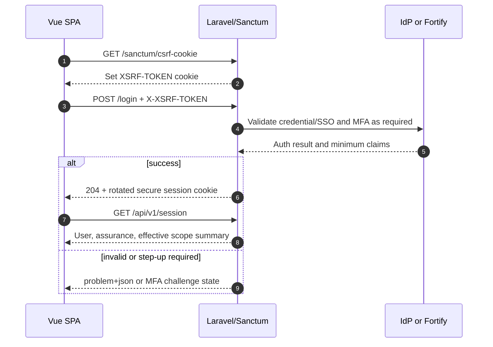

# API Guidelines

Versi: **1.0.0-draft — 2026-08-07**  
Status: **design-first contract; tidak ada endpoint produksi yang dinyatakan tersedia**

## 1. Consumers and boundaries

| Consumer | Authentication | Allowed data boundary |
|---|---|---|
| Vue first-party SPA | Laravel Sanctum stateful session + CSRF | resource/action sesuai effective grant |
| Filament | Laravel session + CSRF + policy | administrative resources/actions; bukan bypass API policy |
| Respondent browser | short-lived invitation exchange → isolated response session | one campaign/draft; no identity/content cross-link in anonymous mode |
| Scheduled/queue worker | workload identity/internal invocation | fixed job type and minimum object references |
| SIAKAD/SSO/email/AI adapters | interface-specific credential | allowlisted fields/direction/purpose only |
| Future external client/webhook | disabled until separate approval | no inherited first-party privilege |

The API is not a generic form builder or public integration surface. The initial contract is same-origin and institution-scoped.

## 2. Style, base path, and media type

- REST/resource-oriented JSON over HTTPS.
- Versioned API base: `/api/v1`.
- Authentication bootstrap routes remain Laravel conventions: `/sanctum/csrf-cookie`, `/login`, `/logout`; they are documented but not duplicated below `/api/v1`.
- Resource paths use lowercase plural kebab-case: `/instrument-versions/{instrument_version_id}`.
- JSON properties use `snake_case` to match Laravel conventions and avoid hidden client/server transforms.
- Requests use `Content-Type: application/json`; responses use `application/json`. Errors use `application/problem+json` with stable extensions.
- UTF-8, ISO 8601/RFC 3339 timestamps in UTC, calendar timezone stated separately as IANA name.
- UUIDv7 is serialized in canonical lowercase UUID form; IDs are opaque and never authorization secrets.
- Monetary/scoring decimals are serialized as strings when exact precision matters; display rounding metadata is explicit.
- No client can submit server-managed fields (`id`, state, approval actor, scope, checksum, cost, secret reference).

## 3. Versioning and compatibility

### 3.1 Version layers

| Layer | Version | Rule |
|---|---|---|
| API major | URL `/api/v1` | breaking HTTP/schema/semantic change requires `/api/v2` |
| OpenAPI document | semantic `info.version` | patch for clarification, minor for backward-compatible addition, major follows API major |
| Resource representation | `meta.schema_version` where needed | governs type-specific fields without silently changing meaning |
| Instrument/policy/scoring/prompt | domain version/checksum | immutable and independent of API version |
| Events/jobs/integrations | `event_version`/`schema_version` | consumer supports explicit versions; incompatible change gets new version/type |

### 3.2 Backward compatibility

Compatible within v1: new optional response field, new resource/link, new enum only when clients are contractually required to handle unknown values, new optional filter, or new endpoint. Breaking: remove/rename/change type/requiredness, change meaning/default, broaden returned classification, change pagination/authorization semantics, or reuse error code differently.

Deprecation needs `Deprecation: true`, `Sunset` timestamp, successor link/documentation, inventory of consumers, minimum one agreed release window, and usage monitoring. Security/privacy flaws may shorten the window with an incident decision.

## 4. Laravel API Resource transformation principle

Every successful representation is produced by a dedicated Laravel `JsonResource` or `ResourceCollection`, following the current [Laravel API Resources documentation](https://laravel.com/docs/13.x/eloquent-resources). Controllers/actions must not return Eloquent models, arbitrary arrays, hidden pivot attributes, encrypted fields, or provider payloads directly.

Resource responsibilities:

- explicit allowlist and naming/type conversion;
- conditional attributes based on permission, purpose, data class, and object state;
- conditional relationships only when requested through an allowlisted `include` and already authorized/preloaded;
- safe links/actions derived from current policy, not role label alone;
- aggregate suppression and state labels (`zero`, `no_data`, `not_calculated`, `error`, `suppressed`);
- resource-level `meta` for version/checksum/classification/limitations where appropriate;
- collection pagination/link/meta transformation without leaking total for a scope the caller cannot enumerate.

### 4.1 Single resource envelope

```json
{
  "data": {
    "type": "surveys",
    "id": "018f7f2e-4c8d-7c19-8aa2-2fcf27318451",
    "attributes": {
      "code": "akademik-2026-gasal",
      "state": "open",
      "privacy_mode": "detached_anonymous",
      "opens_at": "2026-08-10T01:00:00Z",
      "closes_at": "2026-08-31T16:59:59Z"
    },
    "relationships": {
      "period": {"data": {"type": "survey_periods", "id": "018f7f2e-3ee3-7efa-8124-8142124ba010"}}
    },
    "links": {"self": "/api/v1/surveys/018f7f2e-4c8d-7c19-8aa2-2fcf27318451"}
  },
  "meta": {
    "request_id": "01J4Z6T2E3X9F9ZEM7M8W5D1PC",
    "schema_version": "1.0",
    "resource_version": 7
  }
}
```

This resembles a stable resource envelope but does not claim full JSON:API compliance.

### 4.2 Collection envelope

```json
{
  "data": [],
  "links": {
    "self": "/api/v1/surveys?page[cursor]=...",
    "next": null,
    "prev": null
  },
  "meta": {
    "request_id": "01J4Z6T2E3X9F9ZEM7M8W5D1PC",
    "page": {"limit": 25, "has_more": false},
    "applied_filters": {"state": ["open"]},
    "scope": {"type": "organizational_hierarchy", "root_id": "018f7f2e-..."}
  }
}
```

## 5. Authentication and CSRF flow



Laravel Sanctum SPA authentication initializes CSRF through `/sanctum/csrf-cookie`, then sends the URL-decoded `XSRF-TOKEN` in `X-XSRF-TOKEN` for state-changing requests, as described in the [official Sanctum documentation](https://laravel.com/docs/13.x/sanctum#spa-authentication).

Rules:

- Browser authentication uses session cookie; access token is not stored in `localStorage`.
- Safe reads still require session for internal resources. CSRF is required on unsafe methods `POST`, `PUT`, `PATCH`, `DELETE`.
- `401` means absent/expired authentication; `403` authenticated but disallowed; Laravel-specific CSRF/session expiry is normalized to `419` with `SESSION_OR_CSRF_EXPIRED` for first-party clients.
- Step-up-required returns `403` code `STEP_UP_REQUIRED` with an allowlisted next action; no secret/claim dump.
- Respondent exchange never authenticates an internal user. It creates a campaign-bound response session whose cookie/token cannot call internal endpoints.

## 6. Request and response rules

### 6.1 Request schema

- Unknown properties are rejected on security-/state-critical requests (`additionalProperties: false`).
- String length, collection cardinality, numeric bounds, enum, format, and cross-field constraints are explicit.
- `PATCH` is partial merge semantics for allowed attributes, not JSON Patch. Empty patch is rejected.
- Commands that represent a governed transition use subresources: `POST /instrument-versions/{id}/review-submissions`, not `PATCH state=approved`.
- Upload uses a separate initiation/complete flow in a later implementation contract; metadata cannot claim scan/checksum success.

### 6.2 Status codes

| Code | Use |
|---:|---|
| 200 | successful read/update/command with representation |
| 201 | resource/job created; `Location` returned |
| 202 | asynchronous job accepted, not completed |
| 204 | successful no-body logout/delete/revoke where appropriate |
| 400 | malformed query/JSON/protocol, unsupported include/filter/sort |
| 401 | authentication absent/expired |
| 403 | permission/scope/assurance/purpose/SoD denied |
| 404 | resource absent or concealed because outside scope |
| 409 | state/business/idempotency payload conflict |
| 410 | invitation/export/resource intentionally expired/revoked |
| 412 | `If-Match` resource version is stale |
| 415 | unsupported media type |
| 422 | structurally valid request fails field/domain validation |
| 428 | required `If-Match` or idempotency precondition absent |
| 429 | rate/budget/concurrency limit; `Retry-After` when retryable |
| 500 | unexpected internal failure with safe correlation ID |
| 502/503/504 | dependency invalid/unavailable/timeout for synchronous boundary; core state remains accurate |

## 7. Pagination, filtering, sorting, include, and fields

### 7.1 Pagination

- Default cursor pagination for mutable/high-volume collections: `page[cursor]`, `page[limit]` default 25, maximum 100.
- Cursor is opaque, signed, scope/filter/sort-bound, and expires. Invalid/mismatched cursor returns `400 INVALID_CURSOR`.
- Stable sort always ends with unique `id` tiebreaker.
- Offset/page-number pagination is reserved for small immutable catalogs and must be explicit in catalog.
- Exact `total` is omitted by default when expensive or disclosure-sensitive; approximate/authorized totals are clearly labelled.

### 7.2 Filters

Format: `filter[state]=open,closed`, `filter[owner_unit_id]=...`, `filter[created_from]=...`. Only catalogued fields/operators are accepted; unknown filter is an error, not ignored. Dates use inclusive/exclusive semantics documented per endpoint. Search is bounded, escaped, and never searches Restricted raw text unless an explicit purpose-bound endpoint exists.

### 7.3 Sort

`sort=-created_at,code`; `-` means descending. Each endpoint has an allowlist and deterministic default. Sorting by contact, raw answer, secret, unindexed JSON, or hidden/suppressed metric is prohibited.

### 7.4 Include

`include=period,owner_unit` supports only allowlisted relationships, maximum depth 1 and maximum 3 relationships `[P]`. Include does not expand permission: disallowed relationship is omitted only when documented as conditional, otherwise request returns `403`. No `include=responses`, raw answers, participant contact, linkage, secret, or audit payload.

### 7.5 Sparse field selection

`fields[surveys]=code,state,opens_at,closes_at`. Server intersects requested fields with the resource allowlist and caller's data-class/purpose ceiling. Asking a known but unauthorized sensitive field returns `403`; unknown field returns `400`. Mandatory `type`, `id`, state/suppression metadata, and safety limitations cannot be removed.

## 8. Idempotency

`Idempotency-Key` is required for final submit and all job-creating POSTs (analysis, AI, export, notification batch, retention). It is recommended for other create commands.

| Rule | Contract |
|---|---|
| Format | 16–128 printable ASCII; recommended UUIDv7/random UUID; never token/PII |
| Scope | authenticated actor or response session + operation + target resource |
| Request fingerprint | canonical method/path/body hash plus policy/resource version |
| Same key + same fingerprint | replay original status/body/Location; no duplicate side effect |
| Same key + different fingerprint | `409 IDEMPOTENCY_KEY_REUSED` |
| Concurrent same key | one owner; others receive completed replay or `409 IDEMPOTENCY_IN_PROGRESS` with safe retry |
| Retention | submit 7 days `[P]`; jobs 24 hours `[P]`, while durable business uniqueness/result ID persists longer |
| Provider retry | same logical key where provider supports it; internal uniqueness remains authoritative |

The idempotency record never stores plaintext invitation/API token or unrestricted request payload.

## 9. Optimistic locking

- Mutable resource responses emit `ETag: "v{lock_version}"` and `meta.resource_version`.
- `PATCH`/mutable transition requires `If-Match`; absent → `428 PRECONDITION_REQUIRED`.
- Mismatch → `412 VERSION_CONFLICT` with submitted version, current version, resource ID, and safe refresh link; it does not echo the caller's sensitive body or disclose current hidden fields.
- Client reloads, compares, reapplies, and submits with the new ETag. Server never last-write-wins silently.
- Published instrument versions, submitted responses, released snapshots, and released reports are immutable; update returns `409 IMMUTABLE_RESOURCE`, not a lock conflict.
- Autosave uses both `If-Match` and `Idempotency-Key`. A duplicate exact autosave returns the original resource version; a stale different autosave returns `412`.

## 10. Rate limiting and workload limits

Initial limits are `PROPOSED` pending capacity and abuse tests.

| Class | Proposed limit | Key/dimension |
|---|---:|---|
| CSRF/login | CSRF 30/min; login 5/min account + 20/min coarse network | account and security signal |
| Invitation exchange | 10/10 min token + 30/10 min coarse network | token hash/network signal |
| Respondent survey read | 60/min response session | campaign/session |
| Autosave | 60/min response | response session + response ID |
| Final submit | 5/10 min response | response session + response ID |
| Internal reads | 120/min user | user + route class |
| Administrative writes | 60/min user | user + route class |
| Analysis/export job create | 10/hour user and 30/hour organizational scope | actor + scope + job type |
| AI job | 2/min and 20/day user plus token/currency budget | user + use case + institution |
| Sensitive download | 20/hour user; one-time link | user + export + scope |

Responses include `RateLimit-Limit`, `RateLimit-Remaining`, `RateLimit-Reset`, and when applicable `Retry-After`. Limits never reveal whether an out-of-scope resource exists. Expensive query/include/field cardinality and concurrent job quotas are enforced separately from request rate.

## 11. Organizational scope and reporting threshold

### Leadership result invariant

`GET /leadership/results` and report reads:

1. derive current effective organizational hierarchy from session grant, never trust client `unit_id` as authorization;
2. intersect requested unit/campaign/period with that hierarchy;
3. read only a **released aggregate snapshot**, never raw responses or candidate cells;
4. apply stored minimum-cell, sensitive-cell, complementary suppression, dominance, and anti-differencing policy;
5. use Laravel Resource field projection to omit hidden dimensions/metrics and include `n`, missing, coverage, suppression state, limitation, release/checksum metadata;
6. return `404` for out-of-scope resource and safe `suppressed` representation for an in-scope suppressed cell.

### Export invariant

Export permission is not inherited from read. Scope/threshold/classification/approval are checked at request, worker generation, release approval, and download. The worker re-resolves current authorization plus immutable requested scope/policy; any revocation or parity failure quarantines the file. Export cannot accept arbitrary fields/filter SQL. Signed URL is short-lived and not an authorization substitute.

## 12. Caching and conditional requests

- Safe released resources may emit `ETag`/`Last-Modified`; `If-None-Match` can return `304`.
- Personalized, raw, confidential, admin, response-session, and error responses use `Cache-Control: private, no-store` as appropriate.
- Shared cache is permitted only for explicitly public released summaries with revocation/invalidation strategy.
- Redis cache key contains released snapshot version + scope hash + field/include/filter format, never contact/raw answer.

## 13. Documentation and contract governance

- `openapi.yaml` uses OpenAPI 3.1.1 and is design-first.
- Every operation has stable `operationId`, tags, security, permission/scope extension, success and relevant error responses.
- Catalog/OpenAPI drift is checked in review; implemented routes later require contract/integration tests.
- Examples are synthetic, contain no real identifiers/contact/answer, and must validate against schema.
- Unknown enums must not automatically grant behavior. Server defaults to safe denial/unknown state.
- Laravel Resources, policies, request validators, route names, events, and integration adapters will be traced to operation/event IDs in later phases.
