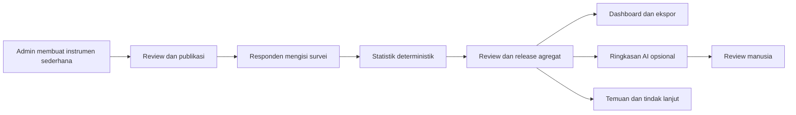

# Phase 0–1 — Keselarasan Tugas Akhir

Status: **PROVISIONAL — menunggu persetujuan dosen dan narasumber LPMPP**  
Tanggal: 14 Agustus 2026

Dokumen ini menetapkan jalur implementasi berdasarkan instruksi pemilik repository. Status provisional berarti pembangunan teknis boleh dilanjutkan dengan data sintetis, tetapi judul dan klaim penelitian belum boleh dianggap disetujui secara akademik.

## Status pelaksanaan roadmap

| Phase | Hasil teknis | Status |
|---|---|---|
| 0 — ruang lingkup | jalur survei, judul kerja, non-goals, dan gate eksternal dicatat | Selesai provisional |
| 1 — perancangan | pilot teknis, aktor, alur utama, target keberhasilan, dan batas klaim dicatat | Selesai provisional |
| 2 — form dan role | form sederhana menyediakan lima contoh audiens, kategori/indikator tanpa kode manual, serta pilihan Ya/Tidak; akses AI/tindak lanjut tersedia untuk admin, super admin, dan leader sesuai permission | Teruji teknis |
| 3 — statistik/dashboard | referensi hitung manual, filter per survei, grafik batang/radar/donut, tabel angka, drill-down agregat, dan ekspor snapshot tersedia | Teruji teknis |
| 4 — AI | satu use case ringkasan agregat, pilihan run/reviewer tanpa ID manual, human review, 10 kasus sintetis, dan rubrik evaluasi tersedia | Teruji teknis; efektivitas belum tervalidasi manusia |
| 5 — pilot/UAT | skenario, target, dan format bukti tersedia | Menunggu UAT dan persetujuan eksternal |
| 6 — bukti/laporan | matriks klaim dan bukti serta aturan penyimpanan tersedia | Siap diisi setelah pilot/UAT |

## Keputusan jalur

- Objek utama: **aplikasi survei mutu perguruan tinggi**.
- Bukan objek utama: sistem AMI/SPMI/akreditasi end-to-end.
- AI: fitur bantuan analisis agregat, bukan pengambil keputusan dan bukan penghitung statistik utama.
- Data pimpinan: agregat yang telah dirilis dan memenuhi ambang privasi; tidak ada jawaban individual.

## Judul kerja

Judul aman sebelum evaluasi AI selesai:

> Rancang Bangun Aplikasi Survei Mutu dan Dashboard Visualisasi Data Perguruan Tinggi: Studi Kasus Institut Teknologi Dirgantara Adisutjipto

Judul bersyarat apabila Phase 4 lulus evaluasi:

> Pemanfaatan Artificial Intelligence untuk Analisis dan Visualisasi Data Survei Mutu Perguruan Tinggi: Studi Kasus Institut Teknologi Dirgantara Adisutjipto

## Pilot teknis

- Survei: kepuasan layanan akademik.
- Responden: mahasiswa S1 Informatika.
- Data selama pembangunan: sintetis dan berlabel simulasi.
- Periode: satu periode aktif dan satu periode pembanding.
- Pemilik: unit/program studi yang ditetapkan pada fixture.
- Output: persentase jawaban, skor kategori, tren periode, detail agregat per pertanyaan, ekspor, dan satu ringkasan AI yang direview manusia.

Pemilihan pilot ini merupakan asumsi teknis dari penggunaan project saat ini. Data, instrumen, target, dan unit resmi harus dikonfirmasi LPMPP sebelum pilot nyata.

## Aktor dan batas akses

| Aktor | Tugas | Batas |
|---|---|---|
| Responden | melihat survei yang sesuai, mengisi, mengirim, melihat riwayat | tidak melihat dashboard atau jawaban orang lain |
| Admin LPMPP | membuat survei, menganalisis, mengelola AI dan tindak lanjut sesuai permission | tidak melakukan self-approval dan tidak otomatis melihat jawaban mentah |
| Super admin | akun, role, unit, konfigurasi sistem/AI | tidak otomatis memperoleh jawaban individu |
| Leader | melihat dashboard, hasil AI yang disetujui, dan status tindak lanjut | read-only |

## Alur utama

## Target keberhasilan provisional

Target berikut harus dikonfirmasi saat bimbingan:

1. Admin dapat membuat survei berkategori tanpa mengetik kode teknis.
2. Hasil fixture statistik sama dengan perhitungan manual dan dapat direproduksi.
3. Tidak ada akses lintas role/unit pada pengujian otomatis.
4. Dashboard dapat menjawab skor, persentase pilihan, tren, dan status data dari satu halaman.
5. Minimal 80% tugas pada UAT inti berhasil tanpa bantuan pengembang.
6. Output AI tidak mengarang angka, menyebut keterbatasan, dan memperoleh nilai rata-rata minimal 4 dari 5 pada rubrik reviewer.

## Gate eksternal

| Gate | Pemilik keputusan | Status |
|---|---|---|
| Judul akhir dan rumusan masalah | Dosen pembimbing | Menunggu |
| Survei/unit pilot dan instrumen | LPMPP/dosen | Menunggu |
| Grafik yang benar-benar dipakai dalam laporan | Pak Heru/LPMPP | Menunggu |
| Kebijakan data, retensi, ambang privasi, dan provider AI | LPMPP/TIK/pemilik data | Menunggu |
| UAT dan penerimaan manfaat | Admin LPMPP dan pimpinan | Menunggu |

## Non-goals

- sistem AMI/SPMI/akreditasi lengkap;
- keputusan otomatis berbasis AI;
- banyak provider AI sekaligus;
- seluruh fitur Google Form/OpnForm;
- jawaban individu pada dashboard pimpinan;
- production go-live tanpa UAT, privacy approval, dan operational sign-off.

## Hubungan dengan dokumen existing

- Use case rinci: [use-cases.md](../05-process-and-uml/use-cases.md)
- Metrik produk: [success-metrics.md](../02-product-scope/success-metrics.md)
- Batas domain: [scope-and-boundaries.md](../02-product-scope/scope-and-boundaries.md)
- UAT dasar: [uat.md](../14-quality-deployment/uat.md)
- Analisis judul: [analisis-kesesuaian-judul-dan-roadmap-revisi.md](../analisis-kesesuaian-judul-dan-roadmap-revisi.md)
